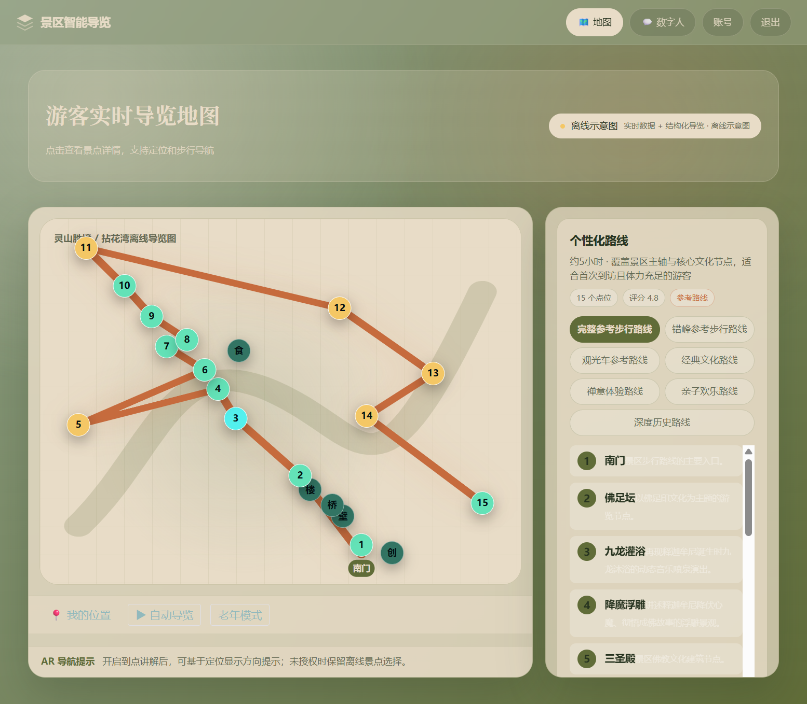
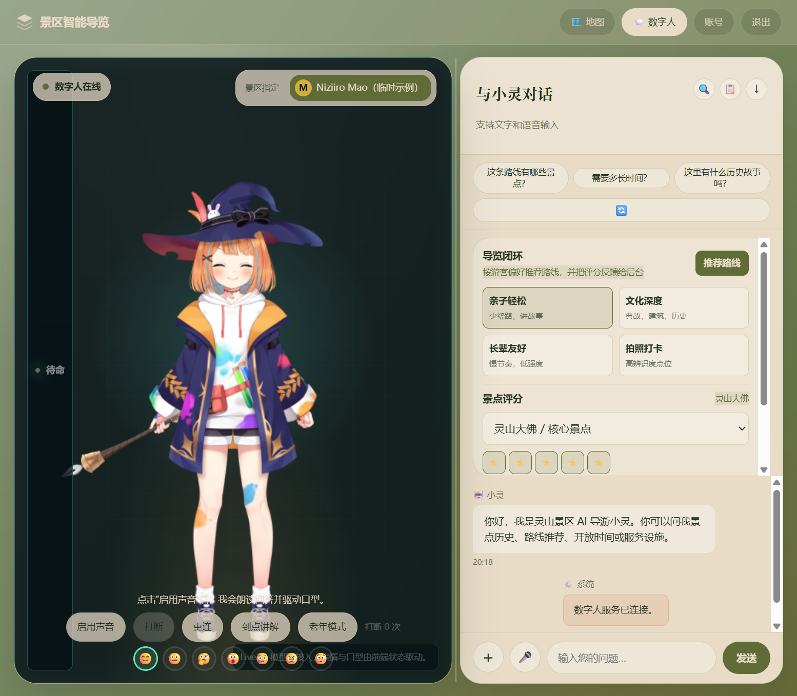
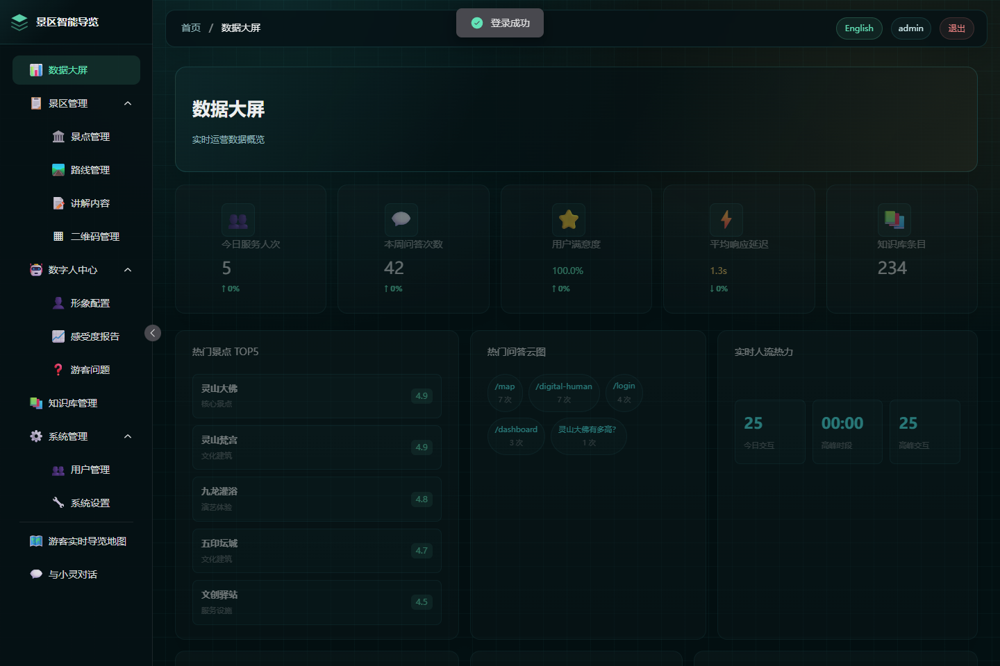
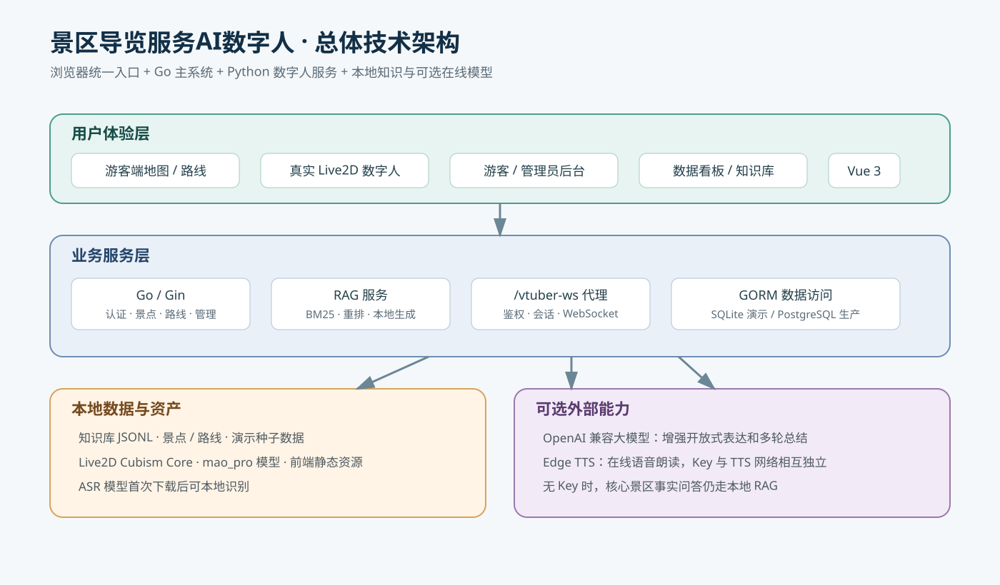
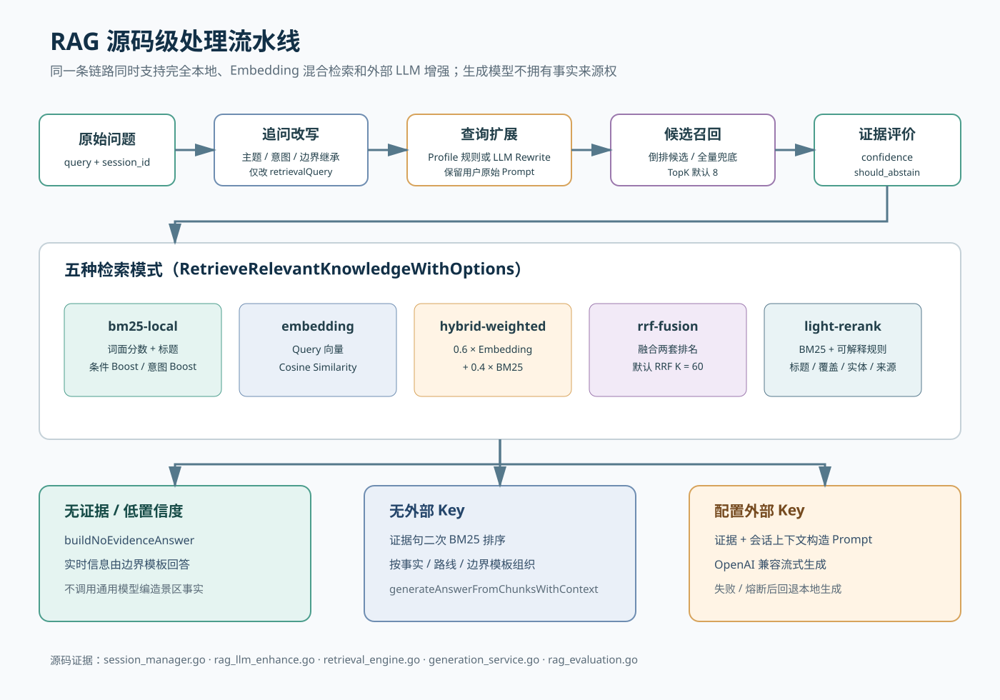

# Scenic Spot Guide System｜景区智能导览

[](https://github.com/4evour/Scenic_spot_guide_system/actions/workflows/ci.yml)

一个面向景区游客与运营人员的全栈演示项目：游客可以查看路线、向知识库提问并与 Live2D 数字人交互；管理员可以维护景点内容并查看运营看板。主服务使用 Go/Gin、Vue 3 和 GORM，提供本地 RAG 检索，并可与独立的 Open-LLM-VTuber 服务联调。

> **定位与边界**：这是可复现的作品集/演示系统，不宣称大规模生产部署能力。PostgreSQL 是主要数据库配置，SQLite 仅用于本地开发和轻量测试；不配置外部模型服务时，生成式回答和实时语音能力会降级。

**从这里开始**：[运行截图](#运行截图) · [功能概览](#功能概览) · [快速启动](#快速启动) · [访问入口](#访问入口) · [数字人服务](#数字人服务) · [RAG 评估](#rag-评估)

## 运行截图

以下是本地运行项目时保存的 Playwright 页面截图，使用演示数据，**不是在线服务实时画面**。游客地图为结构化离线示意图，不应理解为真实底图或实时导航。

### 游客导览与路线



### Live2D 数字人对话



图中的 `mao_pro` 是 Live2D Inc. 提供的 Niziiro Mao 临时联调示例模型，不是项目自有角色；计划中的 `lingshan_xiaoling` 模型目前不随仓库提供。使用和分发前请阅读 [Live2D 资源许可](LICENSE-Live2D.md)。实时语音与 WebSocket 交互需要独立的数字人服务。

> This content uses sample data owned and copyrighted by Live2D Inc. The sample data are utilized in accordance with terms and conditions set by Live2D Inc. This content itself is created at the author’s sole discretion.

### 管理员数据看板



看板数字来自截图时的本地演示环境，不代表线上运营数据。截图源文件存放于本地 `output/playwright/`；仓库内只保留用于文档展示的副本。

## 系统架构

主服务承载 API、数据管理和 RAG；Vue 前端提供游客、管理与看板界面；Open-LLM-VTuber 作为可独立运行的数字人服务。详细边界和调用链见 [架构文档](docs/architecture.md)。



RAG 的检索、重排与生成路径如下；各模式的适用范围和评测口径见 [RAG 评估](#rag-评估)。



## 功能概览

- **游客问答（RAG）**：基于景区知识库进行检索增强问答，支持 5 种检索模式（BM25、Embedding、加权混合、RRF 融合、可解释重排），SSE 流式回答（打字机效果），多轮对话上下文追问改写。
- **用户反馈闭环**：每个 AI 回答支持 👍👎 反馈，数据自动进入统计大屏。
- **数字人导览**：Live2D 虚拟形象 + 情绪检测 + 语音合成，通过 OpenAI 兼容接口和 `/vtuber-ws/*` 代理对接 Open-LLM-VTuber。
- **数据大屏**：基于真实接口展示 5 个 KPI 卡片、24h 趋势、关注点分布、热门问答、满意度趋势、知识库条目和最近对话；暂无后端来源的热力、终端、活动等运营态势显示空状态，不再使用硬编码演示数值。
- **管理后台**：景点、路线、讲解内容、二维码、知识库、数字人形象、游客问题处理、游客感受度报告和系统设置。
- **Prometheus 监控**：`/metrics` 端点暴露请求量、延迟 P50/P95/P99、RAG 查询耗时、缓存命中率等指标。
- **安全加固**：JWT 算法混淆防护、IDOR 权限校验、密码策略、全局限流、CSP/HSTS 安全头、登录统一错误防枚举、CSRF 防护、Secure Cookie 策略、限流器优雅停止、API 响应体大小限制、/metrics 端点管理员鉴权保护。
- **RAG 评估框架**：当前真实资料评测集为 162 个切片、210 条问答，支持 5 种模式对比、分组统计和失败分析。最近一次本地 `light-rerank` retrieval-only 结果为通过率 97.62%、Recall@8 94.33%、MRR@8 0.798；这不是线上准确率或生成质量指标。

## 接口契约与鉴权

- 登录使用 Cookie 会话：`POST /api/v1/login` 只设置 `auth_token` HttpOnly Cookie，响应体返回用户资料，不返回 JWT；前端通过 `GET /api/v1/user/me` 恢复会话。
- Vue 游客地图、数字人入口、数字人 API 都属于登录后体验；`/api/v1/dh/session/create`、`/api/v1/dh/chat/text`、`/api/v1/dh/chat/voice-transcript`、`/api/v1/dh/feedback` 均需要登录。
- 对外 JSON 字段统一使用 `snake_case`，例如 `image_url`、`sort_order`、`spot_id`、`content_type`、`audio_url`、`created_at`、`updated_at`。
- 管理员用户管理接口为 `/api/v1/admin/users`：支持分页列表、创建、编辑和删除；创建/改密复用后端密码策略与 bcrypt，编辑时密码留空表示不修改。
- `/api/v1/contents` 是管理员分页列表；公开导览内容查询保留 `/api/v1/contents/:id`、`/api/v1/contents/spot/:spot_id` 和 `/api/v1/contents/spot/:spot_id/type`。
- 游客问题处理使用 `/api/v1/queries` 和 `/api/v1/queries/unanswered` 管理接口，Vue 管理端提供全部/未回答切换、回复编辑、处理状态和删除。
- `/vtuber-ws/*` WebSocket 代理只接受同源浏览器自动携带的 HttpOnly `auth_token` Cookie，或 `auth.token.<JWT>` 子协议；URL query 不再接受 JWT，避免凭据进入访问日志和代理日志。

## 技术栈

- 后端：Go 1.25.0、Gin、GORM、PostgreSQL、SQLite local/dev profile
- 前端：Vue 3、Vite、TypeScript、PixiJS、Live2D
- AI/RAG：OpenAI 兼容模型接口（示例配置为 DashScope/Qwen，可替换为 DeepSeek 等服务）、DashScope `text-embedding-v2`、本地 JSONL 知识库、BM25 + Embedding 双路召回 + RRF 融合
- 监控：Prometheus（`/metrics` 端点：请求量、延迟直方图、RAG 查询耗时、缓存命中率）
- 静态资源：Go 服务托管 `static` 目录，Vue 构建产物输出到 `static/vue-app`

## 目录结构

```text
.
├── main.go                      # 服务启动和依赖装配
├── cmd/                         # demo-seed、rag-eval、坐标校准等命令
├── configs/                     # 本地配置目录，config.yaml 不提交
├── internal/                    # 后端配置、模型、仓储、服务和处理器
├── knowledge/                   # 景区知识库语料、基础样例和 3000/300 合成规模验证集
├── web-vue/                     # Vue 前端源码
├── static/                      # 静态页面、数字人资源和 Vue 构建产物
├── docs/                        # API、数字人联调和面试说明
├── docker-compose.yml            # PostgreSQL + 应用编排
└── PROJECT_OVERVIEW.md          # 项目长期说明文档
```

## 环境要求

- Go 1.25.0 或与 `go.mod` 匹配的版本
- Node.js 20+ 与 npm
- Docker Desktop（Compose 路径）或本地 SQLite；使用外部 PostgreSQL 时需要 PostgreSQL 16+
- 可选：兼容 OpenAI 的 LLM API Key、DashScope Embedding API Key；Edge TTS 默认不需要项目侧 API Key。无外部 Key 时仍可启动页面并运行本地检索评估，但生成式回答和在线语音能力会降级。

## 快速启动

### 路径 A：Docker Compose + PostgreSQL

Compose 不读取 `configs/config.yaml` 中的数据库密码，而是要求通过环境变量提供。首次启动前复制环境变量模板并填入本机值：

```powershell
Copy-Item .env.example .env
# 编辑 .env，至少填写：
# SCENIC_GUIDE_DATABASE_PASSWORD=<YOUR_DATABASE_PASSWORD>
# SCENIC_GUIDE_SECURITY_JWT_SECRET=<64_HEX_CHARACTERS>
```

`.env` 只用于本地启动，必须保持未提交。JWT 密钥仅接受恰好 64 个 hex 字符（32 bytes），或 base64 解码后不少于 32 bytes；不要把真实密钥、数据库密码或 API Key 写入 README、日志或提交记录。

可用以下命令生成 JWT 密钥：

```powershell
openssl rand -hex 32
```

没有 OpenSSL 时：

```powershell
$rng = [System.Security.Cryptography.RandomNumberGenerator]::Create()
$bytes = New-Object byte[] 32
$rng.GetBytes($bytes)
$rng.Dispose()
$env:SCENIC_GUIDE_SECURITY_JWT_SECRET = ($bytes | ForEach-Object { $_.ToString("x2") }) -join ""
```

```powershell
docker compose up --build
```

Compose 默认启动 `postgres:16-alpine`，应用通过 `SCENIC_GUIDE_DATABASE_DRIVER=postgres` 连接数据库。首次启动不会自动创建演示用户；需要演示数据时，在应用容器之外按“演示数据初始化”章节执行，或直接使用路径 B。

### 路径 B：本地 SQLite + 演示模式

该路径适合快速体验，不需要启动 PostgreSQL：

```powershell
Copy-Item configs/config.example.yaml configs/config.yaml
$rng = [System.Security.Cryptography.RandomNumberGenerator]::Create()
$bytes = New-Object byte[] 32
$rng.GetBytes($bytes)
$rng.Dispose()
$env:SCENIC_GUIDE_SECURITY_JWT_SECRET = ($bytes | ForEach-Object { $_.ToString("x2") }) -join ""
go run ./cmd/demo-seed -admin-password "<YOUR_LOCAL_DEMO_PASSWORD>"
go run .
```

演示种子会创建 `visitor` 和 `admin` 两个本地账号，并导入当前 243 条知识切片（81 条基础资料 + 162 条真实资料）；密码由你在命令行传入，不在仓库中提供固定值。默认配置使用 SQLite，仅用于本地开发或轻量测试，不是 PostgreSQL 故障后的自动接管或高可用方案。

### 前端构建与检查

如果需要从源码重新生成前端静态资源：

```powershell
go mod download
Set-Location web-vue
npm install
npm run build
Set-Location ..
```

公开仓库或提交前建议额外运行：

```powershell
node scripts/check-secrets.mjs
```

服务默认监听 `0.0.0.0:8080`；仅在本机使用时建议通过防火墙或反向代理限制访问范围。启动后会自动迁移 PostgreSQL 或显式配置的 SQLite 数据库，并在知识库为空时导入 `knowledge/lingshan_chunks.jsonl`。

## 一键复现

本项目不提供公网 Demo 链接，仓库负责可复现，博客负责展示说明。最短的本地演示路径是：

```powershell
powershell -NoProfile -ExecutionPolicy Bypass -File .\scripts\start-local.ps1 -Restart
```

启动后访问 `http://127.0.0.1:8080/` 会统一跳转到数字人登录入口 `/digital-human#/login`。管理后台和数据看板继续保留独立路由。无外部 Key 时，RAG 评估和基础问答使用本地 BM25/词面检索；LLM、Embedding 和在线语音仅作为可选增强。

复现 RAG smoke test：

```powershell
go run ./cmd/rag-eval -k 8 -fail-on-miss
```

复现 3000/300 合成闭集实验：

```powershell
go run ./cmd/rag-eval -knowledge knowledge/lingshan_scale_3000.jsonl -eval knowledge/lingshan_eval_300.json -k 8 -bench -concurrency 16 -repeat 1 -retrieval-only -fail-on-miss
```

## 访问入口

- 统一入口：`http://127.0.0.1:8080/`（跳转到数字人登录页）
- Vue 应用：`http://127.0.0.1:8080/app`
- 数据看板：`http://127.0.0.1:8080/dashboard`
- 管理后台：`http://127.0.0.1:8080/admin`
- 数字人登录：`http://127.0.0.1:8080/digital-human#/login`
- 健康检查：`http://127.0.0.1:8080/health`

## 数字人服务

项目保留 Vue Live2D 视图，同时主联调路径定位为 Open-LLM-VTuber 协议适配和前端二开。后端提供 `/v1/chat/completions` OpenAI 兼容接口、`stream=true` SSE 流式响应，并将 `/vtuber-ws/*` 代理到本机 `127.0.0.1:12393`。

`Open-LLM-VTuber/frontend/assets/scenic-tech-demo.js` 和 `.css` 是景区定制注入层，包含品牌导览面板、连接状态、麦克风权限状态、回答流式状态、打断/重试按钮和当前会话 `trace_id` 展示。该路径只有在按本地答辩包要求将 `Open-LLM-VTuber` 与本仓库放在同级目录时才存在；联调清单见 `docs/digital-human-production-check.md`。

如不启动外部数字人服务，普通后台、看板和基础问答接口仍可运行；涉及实时语音或 WebSocket 驱动的能力会受限。

## 常用命令

```powershell
make check
go test ./...
go vet ./...
go run ./cmd/rag-eval -k 8 -format text
go run ./cmd/rag-eval -knowledge knowledge/lingshan_scale_3000.jsonl -eval knowledge/lingshan_eval_300.json -k 8 -bench -concurrency 16 -repeat 1 -retrieval-only -fail-on-miss
go run ./cmd/rag-eval -knowledge knowledge/real/lingshan_real_chunks.jsonl -eval knowledge/real/lingshan_real_eval_open.json -k 8 -bench -concurrency 16 -repeat 1 -retrieval-only -compare-modes bm25-local,light-rerank

Set-Location web-vue
npm.cmd run check
npm.cmd run lint
npm.cmd run check:data-boundaries
npm.cmd run check:encoding
npm.cmd run build
Set-Location ..
```

## 配置与环境变量

运行时配置默认读取 `configs/config.yaml`，也可以用 `SCENIC_GUIDE_` 前缀的环境变量覆盖嵌套配置，例如：

```powershell
$rng = [System.Security.Cryptography.RandomNumberGenerator]::Create()
$bytes = New-Object byte[] 32
$rng.GetBytes($bytes)
$rng.Dispose()
$env:SCENIC_GUIDE_SECURITY_JWT_SECRET = ($bytes | ForEach-Object { $_.ToString("x2") }) -join ""
$env:SCENIC_GUIDE_DATABASE_DRIVER="postgres"
$env:SCENIC_GUIDE_DATABASE_HOST="127.0.0.1"
$env:SCENIC_GUIDE_DATABASE_PORT="5432"
$env:SCENIC_GUIDE_DATABASE_NAME="scenic_guide"
$env:SCENIC_GUIDE_DATABASE_USER="scenic"
$env:SCENIC_GUIDE_DATABASE_PASSWORD="<YOUR_DATABASE_PASSWORD>"
$env:SCENIC_GUIDE_SECURITY_TOKEN_EXPIRE_HOURS="4"
$env:SCENIC_GUIDE_AI_API_KEY="你的服务端密钥"
```

生产环境部署在反向代理后时，必须将 `SCENIC_GUIDE_TRUSTED_PROXIES` 设为实际代理 IP 或 CIDR，多个值使用逗号分隔，例如 `<reverse-proxy-ip>,<reverse-proxy-cidr>`。未配置时服务仍会启动，但会显式关闭对 `X-Forwarded-For` 的信任并按直连地址限流；当前实现无法自动判断是否处于生产反代之后，因此不会因“生产环境缺失该变量”而主动失败。配置了非法 IP/CIDR 时，Gin 的可信代理初始化会报错并终止启动。

安全头按路由隔离：游客主站、管理端等普通页面的 `script-src` 不包含 `'unsafe-eval'`；只有 `/digital-human` 及其子路由为 Live2D 运行时保留必要的 `'unsafe-eval'`。浏览器 CSP 回归结果见 `docs/digital-human-production-check.md` 的验证记录。

## 编码约定

- 源码和文档统一使用 UTF-8，规则见 `.editorconfig`。
- Windows PowerShell 若直接输出中文出现乱码，通常是控制台代码页/宿主解码问题，不代表文件已损坏。排查时优先使用 UTF-8 明确输出或运行 `npm run check:encoding`。
- `npm run check:encoding` 会扫描源码和文档中的替换字符及常见 mojibake 模式；构建产物和第三方资源不纳入该检查。

## RAG 评估

项目保留 `knowledge/lingshan_chunks.jsonl` 与 `knowledge/lingshan_eval_qa.json` 作为 81 个基础知识切片、5 条评测问答的快速 smoke test；同时提供 `knowledge/lingshan_scale_3000.jsonl` 与 `knowledge/lingshan_eval_300.json` 作为“合成规模验证集”，用于复现 3000 切片、300 问答的闭集检索实验。真实资料评测使用 `knowledge/real/lingshan_real_chunks.jsonl`（162 个切片）和 `knowledge/real/lingshan_real_eval_open.json`（210 条问答）。这些数据不是完整的景区生产知识库，合成闭集结果也不能外推为开放域准确率。

```powershell
go run ./cmd/rag-eval -k 8 -format text
go run ./cmd/rag-eval -k 8 -format json
go run ./cmd/rag-eval -knowledge knowledge/lingshan_scale_3000.jsonl -eval knowledge/lingshan_eval_300.json -k 8 -bench -concurrency 16 -repeat 1 -retrieval-only -fail-on-miss
go run ./cmd/rag-eval -knowledge knowledge/real/lingshan_real_chunks.jsonl -eval knowledge/real/lingshan_real_eval_open.json -k 8 -bench -concurrency 16 -repeat 1 -retrieval-only -compare-modes bm25-local,light-rerank
go run ./cmd/rag-eval -knowledge knowledge/real/lingshan_real_chunks.jsonl -eval knowledge/real/lingshan_real_eval_open.json -k 8 -bench -concurrency 16 -repeat 1 -retrieval-only -mode light-rerank -report-env -format json -out docs/eval-results/lingshan-real-rag-eval-light-rerank.json
go run ./cmd/rag-eval -knowledge knowledge/real/lingshan_real_chunks.jsonl -eval knowledge/real/lingshan_real_eval_open.json -k 8 -bench -concurrency 16 -repeat 1 -retrieval-only -compare-modes bm25-local,light-rerank -format json -out docs/eval-results/lingshan-real-rag-eval-targeted-improvement.json
```

`cmd/rag-eval` 支持 `-mode` 指定检索模式：`bm25-local`、`embedding`、`hybrid-weighted`、`rrf-fusion`、`light-rerank`；也支持 `-compare-modes` 做多模式对比。`hybrid-weighted` 可通过 `-embedding-weight` 和 `-bm25-weight` 调整权重，`rrf-fusion` 可通过 `-rrf-k` 调整融合参数。无外部 Key 的本地可复现路径优先使用 `bm25-local` 和 `light-rerank`；`embedding`、`hybrid-weighted`、`rrf-fusion` 需要配置可用 Embedding Provider。

评估数据格式包含 `question`、`expected_keywords`、`expected_chunk_ids`、`category`、`difficulty`。评估报告包含用例总数、通过率、Recall@K、MRR@K、关键词平均覆盖率、分类统计、失败原因、失败样例和检索耗时 p50/p95；如需在 CI 或脚本中失败退出，可追加 `-fail-on-miss`。

3000/300 合成闭集实验仅作为内部回归数据集，不能外推为开放域真实问答召回率。当前真实资料评测集包含 162 个切片、210 条独立问答；以下结果来自本仓库当前代码和数据，在 `retrieval-only`、`k=8`、并发 16、单轮复现口径下，不包含外部 Embedding、大模型生成、ASR 或 TTS：

| 模式 | 通过率 | Recall@8 | MRR@8 | p50/p95 |
| --- | ---: | ---: | ---: | ---: |
| `bm25-local` | 204/210（97.14%） | 93.93% | 0.777 | 约 17/26 ms |
| `light-rerank` | 205/210（97.62%） | 94.33% | 0.798 | 约 20/32 ms |

延迟会随机器和运行状态波动；这些指标只描述当前评测集上的本地检索链路，不代表线上 SLA、生成质量或开放域泛化能力。

当前轻量 rerank 是本地规则实现，不引入重型 Cross-Encoder。检索链路包含查询扩展、游客问法补强和可解释重排；用户原始问题和生成 prompt 不会被扩展词改写。若数据集或评测用例变化，应重新运行上面的命令并同步更新本表，不要沿用历史指标。

运行时问答接口支持传入 `session_id` 做短期多轮承接。后端只保留最近 5 轮，并在内部提取主题实体、意图类型和实时边界状态，用于把“它有多高”“下雨呢”“现在人多吗”等追问改写成更明确的检索 query。公开 API 响应结构不暴露 `rewritten_query` 或上下文主题；本地无 Key fallback 会按事实、路线、边界三类组织回答，涉及票价、开放、客流、排队、无人机、宠物等实时问题时提示以官方最新公告或现场公示为准。

数据边界和评估口径见 `knowledge/DATASET.md` 与 `docs/rag-eval-report.md`。

## 演示数据初始化

`cmd/demo-seed` 会写入当前配置指向的数据库，适合本地演示或答辩录制前准备数据，不属于只读检查命令：

```powershell
go run ./cmd/demo-seed -admin-password "替换成本地演示密码"
```

推荐通过 `scripts/start-local.ps1 -Restart` 启动答辩环境。脚本会显式启用仅限回环地址的演示模式，在登录页显示 `visitor` 与 `admin` 两组评委账号，并用同一密码初始化 SQLite。普通启动不会返回或显示演示凭据。

演示种子使用 `demo-judge-` 前缀清理和重建自身数据，重复启动不会叠加合成记录，也不会删除不带该标识的普通用户历史。SQLite 文件、`.env.local` 和 `configs/config.yaml` 不随源码分发；评委在干净机器上运行脚本会得到相同结构和规模的基础数据，但不会继承当前电脑上的手工修改、历史对话或外部服务密钥。

数字人是本地答辩包的强制组成部分。源码包必须同时保留同级的 `scenic-guide/` 和 `Open-LLM-VTuber/` 目录；启动脚本会从后者部署 Cubism Core 与 Live2D 模型到主系统静态目录。Core、模型配置或 `.moc3` 缺失时脚本会直接终止，不再把备用头像视为启动成功。打包前可运行 `powershell -NoProfile -ExecutionPolicy Bypass -File .\scripts\check-live2d-local-package.ps1` 检查该契约，打包方需确认 Cubism Core 与模型具备演示和分发授权。

景点坐标存放在 `configs/scenic_spot_coordinates.json`。重新查询高德 Web 服务时，只通过环境变量提供密钥：

```powershell
$env:AMAP_API_KEY = "替换为高德 Web 服务 Key"
# 可选：$env:AMAP_SECURITY_CODE = "替换为安全密钥"
go run ./cmd/amap-calibrate
```

命令仅在五个景点全部返回有效且名称明确匹配时原子替换校准文件；新结果默认 `verified: false`。人工核对入口或主要观景点后填写 `verified_at` 并改为 `verified: true`，再运行 `cmd/demo-seed`。任一查询失败、空结果、坐标越界或名称不确定时，命令返回失败且保留原文件。

## 安全、许可证与贡献

- 认证、CSRF、限流、CSP、Cookie 和 `/metrics` 鉴权边界见 [`docs/api.md`](docs/api.md) 与 [`docs/digital-human-production-check.md`](docs/digital-human-production-check.md)。
- 项目内的 Live2D 示例资源不适用项目代码的默认许可，使用前必须阅读 [`LICENSE-Live2D.md`](LICENSE-Live2D.md)。正式发布应替换为具有独立授权的模型。
- 当前仓库未提供独立的根目录项目许可证；如果要作为通用开源项目分发，请补充 `LICENSE` 并在此处明确代码、数据和第三方资源的许可边界。
- 提交代码前至少运行 `make check`、`go vet ./...` 和 `node scripts/check-secrets.mjs`；涉及前端时再运行 `npm run lint` 与 `npm run build`。

详细的历史修复记录和版本变更请查看 [`CHANGELOG.md`](CHANGELOG.md)，不要把一次性的审查笔记堆积在 README 首页。

## 清理与提交约定

- 不提交 `configs/config.yaml`、`.env`、数据库文件、日志、可执行文件和本地缓存。
- 前端生产构建已关闭 sourcemap，避免提交大体积 `.map` 调试文件。
- 如需更新前端静态资源，请在 `web-vue` 中运行 `npm run build`，并提交刷新后的 `static/vue-app` 产物。
