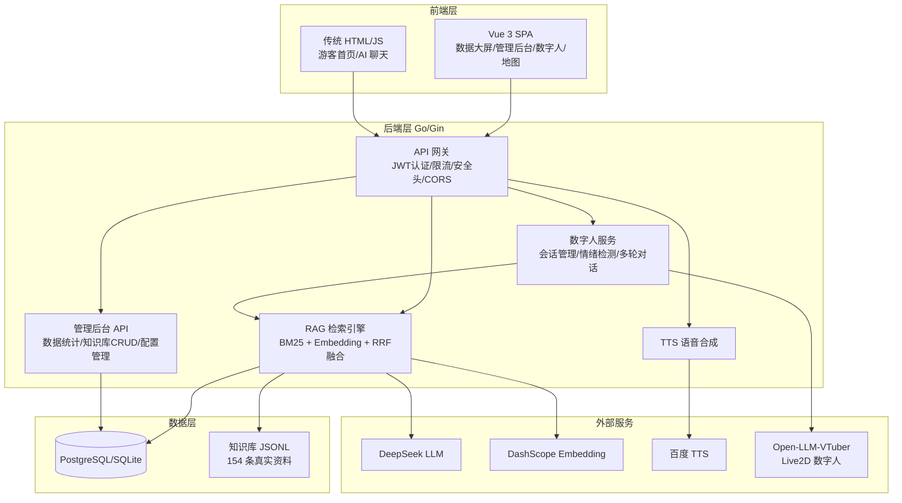
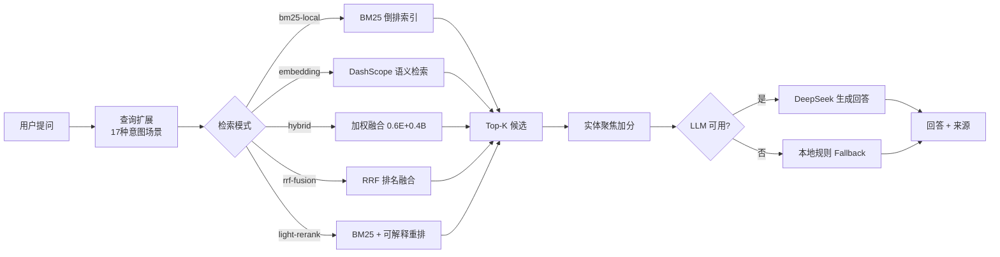

# Scenic Spot Guide System

[](https://github.com/4evour/Scenic_spot_guide_system/actions/workflows/ci.yml)
作者水平有限，并未拿到任何奖项，不过该项目确实耗费了我大量的精力。于是决定开源出来，供大家学习参考，本项目的主要着力点在于rag知识库，生成回答的链路优化，完善的后台管理，鉴权保护。
能力有限，欢迎指正。


景区智能导览系统，面向景区游客问答、导览内容管理、路线推荐、运营数据看板和数字人导览场景。项目采用 Go/Gin 提供后端 API，PostgreSQL/GORM 作为主数据库配置，SQLite 仅作为本地开发和轻量测试配置，Vue 3 + Vite 构建前端页面，并集成本地知识库 RAG 与 Open-LLM-VTuber 数字人联调能力。

## 系统架构



## RAG 检索流程



## 功能概览

- **游客问答（RAG）**：基于景区知识库进行检索增强问答，支持 5 种检索模式（BM25、Embedding、加权混合、RRF 融合、可解释重排），SSE 流式回答（打字机效果），多轮对话上下文追问改写。
- **用户反馈闭环**：每个 AI 回答支持 👍👎 反馈，数据自动进入统计大屏。
- **数字人导览**：Live2D 虚拟形象 + 情绪检测 + 语音合成，通过 OpenAI 兼容接口和 `/vtuber-ws/*` 代理对接 Open-LLM-VTuber。

当前仓库中的 `mao_pro` 为 Live2D Inc. 提供的 Niziiro Mao 官方示例数据，仅作为临时联调形象，不代表灵山专属角色或古典汉服形象。This content uses sample data owned and copyrighted by Live2D Inc. The sample data are utilized in accordance with terms and conditions set by Live2D Inc. This content itself is created at the author’s sole discretion. 完整条款见 `LICENSE-Live2D.md`；正式参赛发布版本应替换为具有独立授权的 `lingshan_xiaoling` 模型。
- **数据大屏**：基于真实接口展示 5 个 KPI 卡片、24h 趋势、关注点分布、热门问答、满意度趋势、知识库条目和最近对话；暂无后端来源的热力、终端、活动等运营态势显示空状态，不再使用硬编码演示数值。
- **管理后台**：景点、路线、讲解内容、二维码、知识库、数字人形象、游客问题处理、游客感受度报告和系统设置。
- **Prometheus 监控**：`/metrics` 端点暴露请求量、延迟 P50/P95/P99、RAG 查询耗时、缓存命中率等指标。
- **安全加固**：JWT 算法混淆防护、IDOR 权限校验、密码策略、全局限流、CSP/HSTS 安全头、登录统一错误防枚举、CSRF 防护、Secure Cookie 策略、限流器优雅停止、API 响应体大小限制、/metrics 端点管理员鉴权保护。
- **RAG 评估框架**：203 条真实问答评测集，Recall@8 99.5%，支持 5 种模式对比、分组统计、失败分析。

## 接口契约与鉴权

- 登录使用 Cookie 会话：`POST /api/v1/login` 只设置 `auth_token` HttpOnly Cookie，响应体返回用户资料，不返回 JWT；前端通过 `GET /api/v1/user/me` 恢复会话。
- Vue 游客地图、数字人入口、数字人 API 都属于登录后体验；`/api/v1/dh/session/create`、`/api/v1/dh/chat/text`、`/api/v1/dh/chat/voice-transcript`、`/api/v1/dh/feedback` 均需要登录。
- 对外 JSON 字段统一使用 `snake_case`，例如 `image_url`、`sort_order`、`spot_id`、`content_type`、`audio_url`、`created_at`、`updated_at`。
- 管理员用户管理接口为 `/api/v1/admin/users`：支持分页列表、创建、编辑和删除；创建/改密复用后端密码策略与 bcrypt，编辑时密码留空表示不修改。
- `/api/v1/contents` 是管理员分页列表；公开导览内容查询保留 `/api/v1/contents/:id`、`/api/v1/contents/spot/:spot_id` 和 `/api/v1/contents/spot/:spot_id/type`。
- 游客问题处理使用 `/api/v1/queries` 和 `/api/v1/queries/unanswered` 管理接口，Vue 管理端提供全部/未回答切换、回复编辑、处理状态和删除。
- `/vtuber-ws/*` WebSocket 代理只接受同源浏览器自动携带的 HttpOnly `auth_token` Cookie，或 `auth.token.<JWT>` 子协议；URL query 不再接受 JWT，避免凭据进入访问日志和代理日志。

## 技术栈

- 后端：Go 1.25.0、Gin、GORM、PostgreSQL、SQLite local/dev profile
- 前端：Vue 3、Vite、TypeScript、PixiJS、Live2D
- AI/RAG：DeepSeek 兼容接口、DashScope `text-embedding-v2`、本地 JSONL 知识库、BM25 + Embedding 双路召回 + RRF 融合
- 监控：Prometheus（`/metrics` 端点：请求量、延迟直方图、RAG 查询耗时、缓存命中率）
- 静态资源：Go 服务托管 `static` 目录，Vue 构建产物输出到 `static/vue-app`

## 目录结构

```text
.
├── main.go                      # 服务启动和依赖装配
├── configs/                     # 本地配置目录，config.yaml 不提交
├── internal/                    # 后端配置、模型、仓储、服务和处理器
├── knowledge/                   # 景区知识库语料、基础样例和 3000/300 合成规模验证集
├── web-vue/                     # Vue 前端源码
├── static/                      # 静态页面、数字人资源和 Vue 构建产物
├── docs/                        # API、数字人联调和面试说明
└── PROJECT_OVERVIEW.md          # 项目长期说明文档
```

## 环境要求

- Go 1.25.0 或与 `go.mod` 匹配的版本
- Node.js 20+ 与 npm
- Docker Desktop 或本地 PostgreSQL 16+
- 可选：DeepSeek API Key、DashScope Embedding API Key、语音服务配置；无 Key 时仍可启动页面并运行本地检索评估

## 快速启动

1. 准备配置文件：

```powershell
Copy-Item configs/config.example.yaml configs/config.yaml
```

在 `configs/config.yaml` 中按需填写 `ai.api_key`、`embedding.api_key`、`speech.api_key`。JWT 密钥优先通过部署环境或密钥管理系统注入；真实配置文件已被 `.gitignore` 忽略，不应提交。

JWT 密钥仅接受以下两种格式：恰好 64 个 hex 字符（32 bytes），或 base64 解码后不少于 32 bytes。任意普通字符串（即使长度达到 32 字符）和包含 `generate`、`change`、`your` 等占位词的值都会被拒绝；校验错误只说明允许的格式，不回显输入密钥。

已安装 OpenSSL 的环境可用以下跨平台命令生成 64 hex：

```shell
openssl rand -hex 32
```

不依赖 OpenSSL 时，可在 PowerShell 中生成：

```powershell
$rng = [System.Security.Cryptography.RandomNumberGenerator]::Create()
$bytes = New-Object byte[] 32
$rng.GetBytes($bytes)
$rng.Dispose()
$env:SCENIC_GUIDE_SECURITY_JWT_SECRET = ($bytes | ForEach-Object { $_.ToString("x2") }) -join ""
```

迁移时要注意签名语义已经变化：旧版本把配置文本本身作为签名密钥，新版本会先把 64-hex 或 base64 文本解码为字节材料。即使升级前后 `SCENIC_GUIDE_SECURITY_JWT_SECRET` 的 64-hex 文本完全不变，新版本也会改用解码后的 32 bytes 签名，因此旧 JWT 仍会失效。多实例不得在新旧版本混跑时做普通滚动发布，否则两种签名语义会导致实例互相拒绝 JWT；应先把同一个合规值同步到所有实例，再协调或原子切换版本，并安排用户重新登录。不要把密钥或启动错误中的敏感值复制到仓库；排查时只检查格式、注入位置和实例一致性。

2. 使用 Docker Compose 启动 PostgreSQL 和应用：

```powershell
$rng = [System.Security.Cryptography.RandomNumberGenerator]::Create()
$bytes = New-Object byte[] 32
$rng.GetBytes($bytes)
$rng.Dispose()
$env:SCENIC_GUIDE_SECURITY_JWT_SECRET = ($bytes | ForEach-Object { $_.ToString("x2") }) -join ""
docker compose up --build
```

Compose 默认启动 `postgres:16-alpine`，应用通过 `SCENIC_GUIDE_DATABASE_DRIVER=postgres` 连接数据库。需要本地轻量运行时，也可以显式切换到 `database.driver: sqlite`；这只是开发配置，不是 PostgreSQL 故障后的自动接管或高可用方案。

3. 安装后端依赖：

```powershell
go mod download
```

4. 构建前端：

```powershell
Set-Location web-vue
npm install
npm run build
Set-Location ..
```

公开仓库或提交前建议额外运行：

```powershell
node scripts/check-secrets.mjs
```

5. 可选：初始化演示账号与演示数据：

```powershell
go run ./cmd/demo-seed --admin-password "ScenicDemo123456"
```

本地演示账号为 `visitor / ScenicDemo123456` 和 `admin / ScenicDemo123456`。该命令会写入管理员、游客、20 个景点、5 条路线、243 条知识切片，并生成约两周的合成交互趋势、聊天会话、景点评分和路线推荐数据。该密码只适用于本地答辩演示，公开部署时必须替换。

6. 本地直启服务：

```powershell
go run .
```

默认监听 `0.0.0.0:8080`。启动后会自动迁移 PostgreSQL 或显式配置的 SQLite 本地数据库，并在知识库为空时导入 `knowledge/lingshan_chunks.jsonl`。

## 一键复现

本项目不提供公网 Demo 链接，仓库负责可复现，博客负责展示说明。默认复现路径不需要 DeepSeek、DashScope 或语音服务 Key：

```powershell
$rng = [System.Security.Cryptography.RandomNumberGenerator]::Create()
$bytes = New-Object byte[] 32
$rng.GetBytes($bytes)
$rng.Dispose()
$env:SCENIC_GUIDE_SECURITY_JWT_SECRET = ($bytes | ForEach-Object { $_.ToString("x2") }) -join ""
docker compose up --build
```

启动后访问 `http://127.0.0.1:8080/` 会统一跳转到数字人登录入口 `/digital-human#/login`。管理后台和数据看板继续保留独立路由。无 Key 情况下，RAG 评估和基础问答使用本地 BM25/词面检索；DeepSeek、DashScope Embedding 和语音服务只作为可选增强。

复现 RAG smoke test：

```powershell
go run ./cmd/rag-eval -k 8 -fail-on-miss
```

复现 3000/300 合成闭集实验：

```powershell
go run ./cmd/rag-eval -knowledge knowledge/lingshan_scale_3000.jsonl -eval knowledge/lingshan_eval_300.json -k 8 -bench -concurrency 16 -repeat 1 -retrieval-only -fail-on-miss
```

## 访问入口

- 统一入口：`http://127.0.0.1:8080/`（跳转到数字人登录页）
- Vue 应用：`http://127.0.0.1:8080/app`
- 数据看板：`http://127.0.0.1:8080/dashboard`
- 管理后台：`http://127.0.0.1:8080/admin`
- 数字人登录：`http://127.0.0.1:8080/digital-human#/login`
- 健康检查：`http://127.0.0.1:8080/health`

## 数字人服务

项目保留 Vue Live2D 视图，同时主联调路径定位为 Open-LLM-VTuber 协议适配和前端二开。后端提供 `/v1/chat/completions` OpenAI 兼容接口、`stream=true` SSE 流式响应，并将 `/vtuber-ws/*` 代理到本机 `127.0.0.1:12393`。

`Open-LLM-VTuber/frontend/assets/scenic-tech-demo.js` 和 `.css` 是景区定制注入层，包含品牌导览面板、连接状态、麦克风权限状态、回答流式状态、打断/重试按钮和当前会话 `trace_id` 展示。联调清单见 `docs/digital-human-production-check.md`。

如不启动外部数字人服务，普通后台、看板和基础问答接口仍可运行；涉及实时语音或 WebSocket 驱动的能力会受限。

## 常用命令

```powershell
make check
go test ./...
go vet ./...
go run ./cmd/rag-eval -k 8 -format text
go run ./cmd/rag-eval -knowledge knowledge/lingshan_scale_3000.jsonl -eval knowledge/lingshan_eval_300.json -k 8 -bench -concurrency 16 -repeat 1 -retrieval-only -fail-on-miss
go run ./cmd/rag-eval -knowledge knowledge/real/lingshan_real_chunks.jsonl -eval knowledge/real/lingshan_real_eval_open.json -k 8 -bench -concurrency 16 -repeat 1 -retrieval-only -compare-modes bm25-local,light-rerank

Set-Location web-vue
npm.cmd run check
npm.cmd run lint
npm.cmd run check:data-boundaries
npm.cmd run check:encoding
npm.cmd run build
Set-Location ..
```

## 配置与环境变量

运行时配置默认读取 `configs/config.yaml`，也可以用 `SCENIC_GUIDE_` 前缀的环境变量覆盖嵌套配置，例如：

```powershell
$rng = [System.Security.Cryptography.RandomNumberGenerator]::Create()
$bytes = New-Object byte[] 32
$rng.GetBytes($bytes)
$rng.Dispose()
$env:SCENIC_GUIDE_SECURITY_JWT_SECRET = ($bytes | ForEach-Object { $_.ToString("x2") }) -join ""
$env:SCENIC_GUIDE_DATABASE_DRIVER="postgres"
$env:SCENIC_GUIDE_DATABASE_HOST="127.0.0.1"
$env:SCENIC_GUIDE_DATABASE_PORT="5432"
$env:SCENIC_GUIDE_DATABASE_NAME="scenic_guide"
$env:SCENIC_GUIDE_DATABASE_USER="scenic"
$env:SCENIC_GUIDE_DATABASE_PASSWORD="scenic_password"
$env:SCENIC_GUIDE_SECURITY_TOKEN_EXPIRE_HOURS="4"
$env:SCENIC_GUIDE_AI_API_KEY="你的服务端密钥"
```

生产环境部署在反向代理后时，必须将 `SCENIC_GUIDE_TRUSTED_PROXIES` 设为实际代理 IP 或 CIDR，多个值使用逗号分隔，例如 `<reverse-proxy-ip>,<reverse-proxy-cidr>`。未配置时服务仍会启动，但会显式关闭对 `X-Forwarded-For` 的信任并按直连地址限流；当前实现无法自动判断是否处于生产反代之后，因此不会因“生产环境缺失该变量”而主动失败。配置了非法 IP/CIDR 时，Gin 的可信代理初始化会报错并终止启动。

安全头按路由隔离：游客主站、管理端等普通页面的 `script-src` 不包含 `'unsafe-eval'`；只有 `/digital-human` 及其子路由为 Live2D 运行时保留必要的 `'unsafe-eval'`。浏览器 CSP 回归结果见 `docs/digital-human-production-check.md` 的验证记录。

## 编码约定

- 源码和文档统一使用 UTF-8，规则见 `.editorconfig`。
- Windows PowerShell 若直接输出中文出现乱码，通常是控制台代码页/宿主解码问题，不代表文件已损坏。排查时优先使用 UTF-8 明确输出或运行 `npm run check:encoding`。
- `npm run check:encoding` 会扫描源码和文档中的替换字符及常见 mojibake 模式；构建产物和第三方资源不纳入该检查。

## RAG 评估

项目保留 `knowledge/lingshan_chunks.jsonl` 与 `knowledge/lingshan_eval_qa.json` 作为 32 个知识切片、5 条评测问答的快速 smoke test；同时提供 `knowledge/lingshan_scale_3000.jsonl` 与 `knowledge/lingshan_eval_300.json` 作为“合成规模验证集”，用于复现 3000 切片、300 问答的闭集检索实验。该数据集不是独立真实景区生产数据，也不等同完整景区知识库。

```powershell
go run ./cmd/rag-eval -k 8 -format text
go run ./cmd/rag-eval -k 8 -format json
go run ./cmd/rag-eval -knowledge knowledge/lingshan_scale_3000.jsonl -eval knowledge/lingshan_eval_300.json -k 8 -bench -concurrency 16 -repeat 1 -retrieval-only -fail-on-miss
go run ./cmd/rag-eval -knowledge knowledge/real/lingshan_real_chunks.jsonl -eval knowledge/real/lingshan_real_eval_open.json -k 8 -bench -concurrency 16 -repeat 1 -retrieval-only -compare-modes bm25-local,light-rerank
go run ./cmd/rag-eval -knowledge knowledge/real/lingshan_real_chunks.jsonl -eval knowledge/real/lingshan_real_eval_open.json -k 8 -bench -concurrency 16 -repeat 1 -retrieval-only -mode light-rerank -report-env -format json -out docs/eval-results/lingshan-real-rag-eval-light-rerank.json
go run ./cmd/rag-eval -knowledge knowledge/real/lingshan_real_chunks.jsonl -eval knowledge/real/lingshan_real_eval_open.json -k 8 -bench -concurrency 16 -repeat 1 -retrieval-only -compare-modes bm25-local,light-rerank -format json -out docs/eval-results/lingshan-real-rag-eval-targeted-improvement.json
```

`cmd/rag-eval` 支持 `-mode` 指定检索模式：`bm25-local`、`embedding`、`hybrid-weighted`、`rrf-fusion`、`light-rerank`；也支持 `-compare-modes` 做多模式对比。`hybrid-weighted` 可通过 `-embedding-weight` 和 `-bm25-weight` 调整权重，`rrf-fusion` 可通过 `-rrf-k` 调整融合参数。无外部 Key 的本地可复现路径优先使用 `bm25-local` 和 `light-rerank`；`embedding`、`hybrid-weighted`、`rrf-fusion` 需要配置可用 Embedding Provider。

评估数据格式包含 `question`、`expected_keywords`、`expected_chunk_ids`、`category`、`difficulty`。评估报告包含用例总数、通过率、Recall@K、MRR@K、关键词平均覆盖率、分类统计、失败原因、失败样例和检索耗时 p50/p95；如需在 CI 或脚本中失败退出，可追加 `-fail-on-miss`。

3000/300 合成闭集实验仅作为内部回归数据集，不能作为简历主卖点，也不能外推为开放域真实问答召回率。简历主口径使用 `knowledge/real/` 真实资料评估集：122 个真实资料切片、203 条独立评测问答。优化前本地 retrieval-only 基线为 BM25 `pass 88.2% / Recall@8 85.5% / MRR@8 0.749`，`light-rerank pass 88.2% / Recall@8 86.0% / MRR@8 0.761`；该结果不包含外部 Embedding、大模型生成、ASR 或 TTS。

当前轻量 rerank 是本地规则实现，不引入重型 Cross-Encoder。2026-05-26 按失败样例做定向优化后，检索链路增加了只用于召回和打分的查询扩展，并补强少量真实资料切片中的游客问法与边界词；用户原始问题和生成 prompt 不会被扩展词改写。真实资料 retrieval-only 单轮对比结果为：`bm25-local` 通过率 98.5%、Recall@8 94.8%、MRR@8 0.793、p50/p95 约 9ms/16-19ms；`light-rerank` 通过率 99.5%、Recall@8 95.3%、MRR@8 0.802、p50/p95 约 10ms/20-21ms。这个提升来自“语料与问法映射增强 + 可解释重排”，不代表生成质量、开放域泛化能力或线上 SLA。

运行时问答接口支持传入 `session_id` 做短期多轮承接。后端只保留最近 5 轮，并在内部提取主题实体、意图类型和实时边界状态，用于把“它有多高”“下雨呢”“现在人多吗”等追问改写成更明确的检索 query。公开 API 响应结构不暴露 `rewritten_query` 或上下文主题；本地无 Key fallback 会按事实、路线、边界三类组织回答，涉及票价、开放、客流、排队、无人机、宠物等实时问题时提示以官方最新公告或现场公示为准。

数据边界和评估口径见 `knowledge/DATASET.md` 与 `docs/rag-eval-report.md`。

## 演示数据初始化

`cmd/demo-seed` 会写入当前配置指向的数据库，适合本地演示或答辩录制前准备数据，不属于只读检查命令：

```powershell
go run ./cmd/demo-seed -admin-password "替换成本地演示密码"
```

推荐通过 `scripts/start-local.ps1 -Restart` 启动答辩环境。脚本会显式启用仅限回环地址的演示模式，在登录页显示 `visitor` 与 `admin` 两组评委账号，并用同一密码初始化 SQLite。普通启动不会返回或显示演示凭据。

演示种子使用 `demo-judge-` 前缀清理和重建自身数据，重复启动不会叠加合成记录，也不会删除不带该标识的普通用户历史。SQLite 文件、`.env.local` 和 `configs/config.yaml` 不随源码分发；评委在干净机器上运行脚本会得到相同结构和规模的基础数据，但不会继承当前电脑上的手工修改、历史对话或外部服务密钥。

数字人是本地答辩包的强制组成部分。源码包必须同时保留同级的 `scenic-guide/` 和 `Open-LLM-VTuber/` 目录；启动脚本会从后者部署 Cubism Core 与 Live2D 模型到主系统静态目录。Core、模型配置或 `.moc3` 缺失时脚本会直接终止，不再把备用头像视为启动成功。打包前可运行 `powershell -NoProfile -ExecutionPolicy Bypass -File .\scripts\check-live2d-local-package.ps1` 检查该契约，打包方需确认 Cubism Core 与模型具备演示和分发授权。

景点坐标存放在 `configs/scenic_spot_coordinates.json`。重新查询高德 Web 服务时，只通过环境变量提供密钥：

```powershell
$env:AMAP_API_KEY = "替换为高德 Web 服务 Key"
# 可选：$env:AMAP_SECURITY_CODE = "替换为安全密钥"
go run ./cmd/amap-calibrate
```

命令仅在五个景点全部返回有效且名称明确匹配时原子替换校准文件；新结果默认 `verified: false`。人工核对入口或主要观景点后填写 `verified_at` 并改为 `verified: true`，再运行 `cmd/demo-seed`。任一查询失败、空结果、坐标越界或名称不确定时，命令返回失败且保留原文件。

## 代码审查修复记录

本次代码审查对后端安全性、健壮性和代码质量进行了全面加固，主要变更如下：

### 后端安全与健壮性
- **CSRF 防护**：所有 /api/v1 路由新增 CSRF Token 校验中间件，登录时同步设置 CSRF Cookie。
- **Secure Cookie**：登录/登出 Cookie 的 Secure 标志根据 GIN_MODE=release 或 SCENIC_GUIDE_COOKIE_SECURE=true 环境变量自动启用。
- **限流器优雅停止**：RateLimitMiddleware 后台清理 goroutine 支持通过 channel 信号停止，新增 StopRateLimiters() 函数供服务关闭时调用，避免 goroutine 泄漏。
- **API 响应体大小限制**：LLM API 响应读取增加 20MB 上限（`readLimitedBody`），防止异常响应耗尽内存。
- **IDOR 修复**：用户更新/删除操作增加 isRecordNotFound 错误区分，避免信息泄露。
- **/metrics 端点保护**：Prometheus 指标端点现在需要 AuthMiddleware + AdminMiddleware 鉴权。
- **密钥检测增强**：scripts/check-secrets.mjs 新增高德地图 API Key 检测规则。

### 代码质量改进
- **统一输入校验**：user_handler.go 提取 validateUsername、validateEmail、validateRole、userPayload 等共享函数，消除重复代码。
- **统一错误处理**：新增 handler/errors.go，提供 isRecordNotFound 统一封装 gorm.ErrRecordNotFound 判断。
- **限流器可测试化**：NewRateLimitMiddlewareWithStopper 内部构造函数支持单元测试中精确控制清理 goroutine。
- **路由整理**：新增 /map Vue SPA 路由、/api/v1/scenic/profile 景区信息接口、/api/v1/track 轻量行为追踪接口。

### 前端改进
- **ESLint + Prettier**：web-vue 新增 .eslintrc.cjs、.prettierrc.json、.prettierignore 配置文件。
- **Vue 路由完善**：router/index.ts 补充缺失路由定义，修复首次导航空白问题。
- **CRUD 表格修复**：useCrudTable.ts 简化逻辑，修复 Go PascalCase 与前端 camelCase 字段名不匹配导致数据不显示的问题。

### 测试覆盖
- 新增 internal/handler/digital_human_auth_test.go：数字人接口鉴权测试。
- 新增 internal/handler/user_handler_test.go：用户注册/登录/CRUD 全流程测试。
- 新增 internal/repository/crud_safety_test.go：通用 CRUD 安全性测试。
- 新增 docs/architecture.md：系统解耦架构说明文档。
## 清理与提交约定

- 不提交 `configs/config.yaml`、`.env`、数据库文件、日志、可执行文件和本地缓存。
- 前端生产构建已关闭 sourcemap，避免提交大体积 `.map` 调试文件。
- 如需更新前端静态资源，请在 `web-vue` 中运行 `npm run build`，并提交刷新后的 `static/vue-app` 产物。
