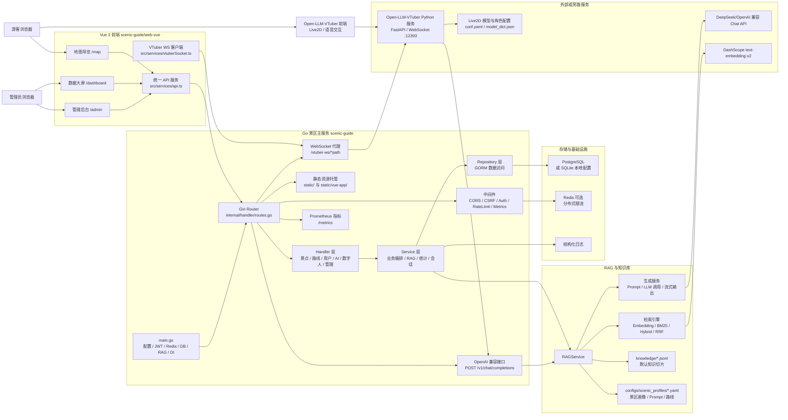
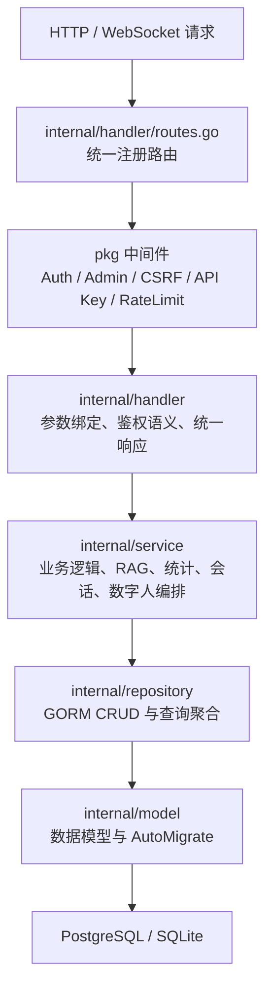
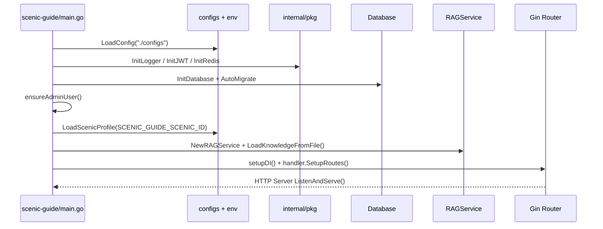
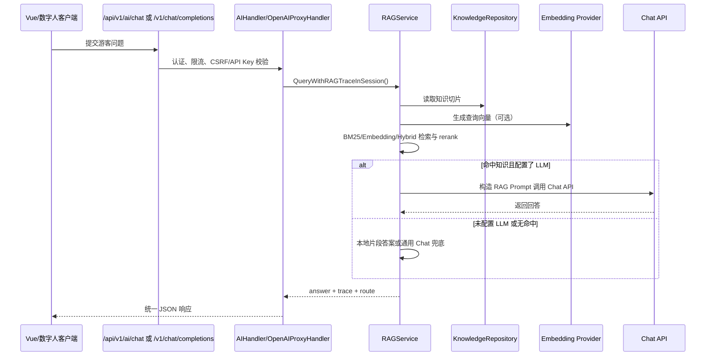
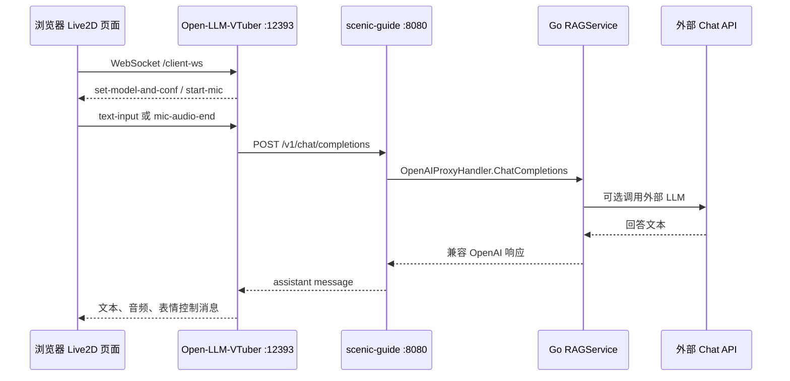

# 系统架构图

## 架构总览



## 后端分层图



## 启动链路



## RAG 问答链路



## 数字人交互链路



## 两个系统完全独立

### 景区系统（scenic-guide）
**职责**：景区数据、知识库、RAG 问答、管理后台
**配置文件**：`configs/scenic_profiles/lingshan.yaml`
**启动命令**：`cd scenic-guide && ./scenic-guide.exe`

**切换景区只需**：
1. 创建新配置 `configs/scenic_profiles/xihu.yaml`
2. 准备知识库 `knowledge/xihu_chunks.jsonl`
3. 设置环境变量 `SCENIC_GUIDE_SCENIC_ID=xihu`
4. 重启

### 数字人系统（Open-LLM-VTuber）
**职责**：Live2D 渲染、语音交互、表情控制
**配置文件**：`conf.yaml`
**启动命令**：`cd Open-LLM-VTuber && python run_server.py`

**切换数字人只需**：
1. 修改 `conf.yaml` 中的 `persona_prompt`
2. 修改 `model_dict.json` 中的表情映射
3. 重启

## API 接口（连接点）

两个系统通过以下 API 连接：

| 接口 | 方法 | 说明 |
|------|------|------|
| `/api/v1/scenic/profile` | GET | 景区完整信息，包含景区名称、数字人配置、快捷问题、路线和主题实体 |
| `/api/v1/scenic/persona` | GET | 数字人角色提示词（从景区配置动态生成） |
| `/api/v1/scenic/quick-asks` | GET | 快捷提问列表 |
| `/api/v1/spots` | GET | 公开景点列表 |
| `/api/v1/routes` | GET | 公开游览路线列表 |
| `/api/v1/ai/chat` | POST | RAG 问答（数字人发送问题，景区系统回答） |
| `/v1/chat/completions` | POST | OpenAI 兼容接口（数字人直接调用） |

## 解耦验证

**场景 1：只换景区，不换数字人**
```bash
# 1. 创建新景区配置
cp configs/scenic_profiles/lingshan.yaml configs/scenic_profiles/xihu.yaml
# 编辑 xihu.yaml

# 2. 设置环境变量
export SCENIC_GUIDE_SCENIC_ID=xihu

# 3. 重启景区系统
./scenic-guide.exe

# 数字人自动获取新景区的 persona_prompt、quick_asks、routes
```

**场景 2：只换数字人，不换景区**
```bash
# 1. 修改数字人配置
vim Open-LLM-VTuber/conf.yaml
# 修改 persona_prompt、TTS 音色、Live2D 模型

# 2. 重启数字人系统
python run_server.py

# 景区系统完全不受影响
```

**场景 3：两个系统分别部署**
```bash
# 机器 A：景区系统
cd scenic-guide && ./scenic-guide.exe  # 监听 :8080

# 机器 B：数字人系统
# conf.yaml 中 base_url 改为机器 A 的地址
python run_server.py  # 监听 :12393
```

## 独立迁移清单

### 迁移景区系统到新景区
- [ ] 创建 `configs/scenic_profiles/新景区.yaml`
- [ ] 准备知识库 JSONL 文件
- [ ] 更新数据库中的景点数据
- [ ] 设置 `SCENIC_GUIDE_SCENIC_ID` 环境变量
- [ ] 重启 Go 后端

### 迁移数字人系统到新形象
- [ ] 准备新的 Live2D 模型文件
- [ ] 更新 `model_dict.json` 表情映射
- [ ] 更新 `conf.yaml` 中的角色配置
- [ ] 重启 Python 后端

### 两个系统同时迁移
- [ ] 完成景区系统迁移
- [ ] 完成数字人系统迁移
- [ ] 验证 API 连通性
- [ ] 测试完整对话流程
