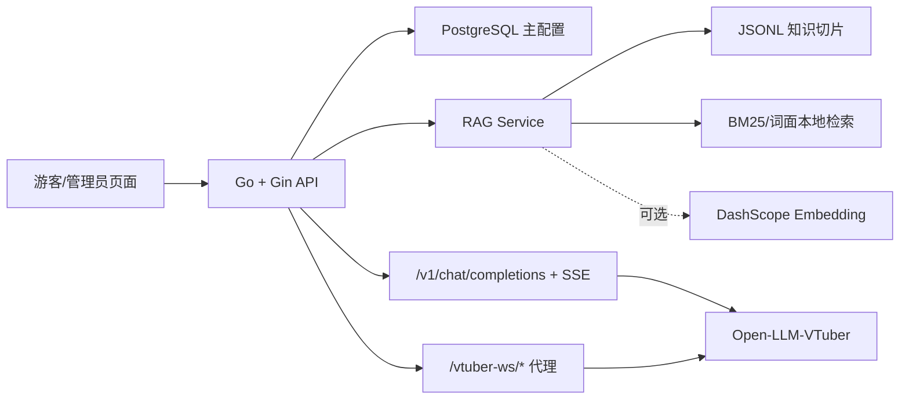

# 一个 Go + RAG 景区导览项目的工程化复现记录

这是一篇博客草稿，用于公开介绍项目，不承诺公网 Demo。博客展示项目思路、截图/GIF、复现步骤和边界；仓库负责让读者能本地运行和复现评估。

## 1. 项目解决什么问题

灵山胜境智能导览系统把景区内容管理、游客问答、路线与景点信息、运营数据看板和数字人联调放到同一个 Go + Vue 项目里。它不是线上商业系统，而是一个作品集实验项目，用来展示后端分层、RAG 检索、OpenAI 兼容接口和数字人协议适配。

## 2. 架构



## 3. 可复现步骤

无 Key 启动：

```powershell
$env:SCENIC_GUIDE_SECURITY_JWT_SECRET="至少32位随机字符串"
docker compose up --build
```

Smoke test：

```powershell
go run ./cmd/rag-eval -k 8 -fail-on-miss
```

合成规模验证：

```powershell
go run ./cmd/rag-eval -knowledge knowledge/lingshan_scale_3000.jsonl -eval knowledge/lingshan_eval_300.json -k 8 -bench -concurrency 16 -repeat 1 -retrieval-only -fail-on-miss
```

## 4. 指标怎么理解

当前 3000/300 结果是合成闭集实验，不是独立真实景区测试集。Recall@8 100.0% 只说明这组合成问题能稳定召回预期切片，不能说明真实游客随便提问也能 100% 命中。

p50/p95 只覆盖本地检索，不包括 DashScope、DeepSeek、语音识别和 TTS 的网络延迟。

## 5. 数字人边界

Open-LLM-VTuber、Live2D 和 PixiJS 是外部框架能力。本项目做的是：

- OpenAI Chat Completions 兼容接口。
- SSE 流式响应。
- `/vtuber-ws/*` WebSocket 代理。
- Open-LLM-VTuber 前端二开状态面板。
- 打断、重试、麦克风状态和 trace 展示。

不要把它描述成自研完整数字人框架。

## 6. 下一步真实生产化

- 接入真实景区资料和人工标注测试集。
- 引入来源引用、置信度和人工审核。
- 用 pgvector、Milvus 或 Qdrant 管理向量检索。
- 用 Redis 做缓存、限流和会话状态。
- 补充监控、日志、错误追踪和线上部署验收。
