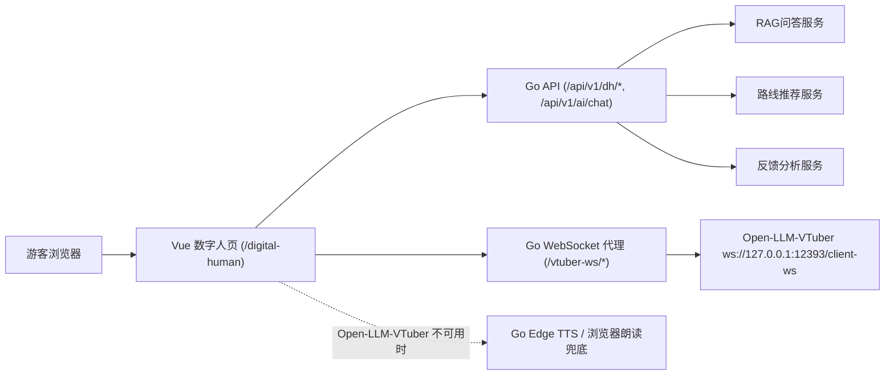
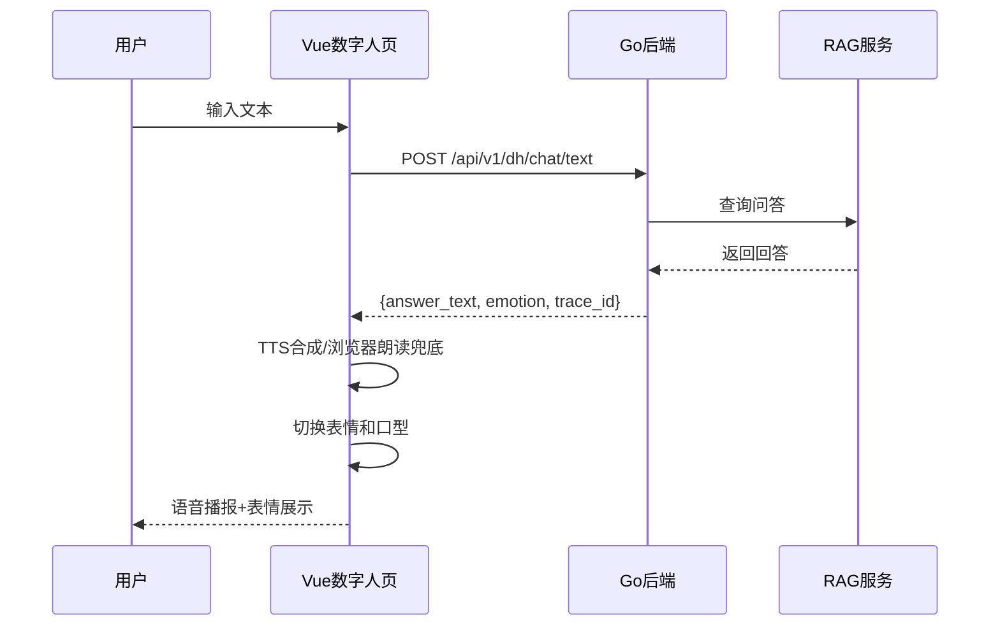
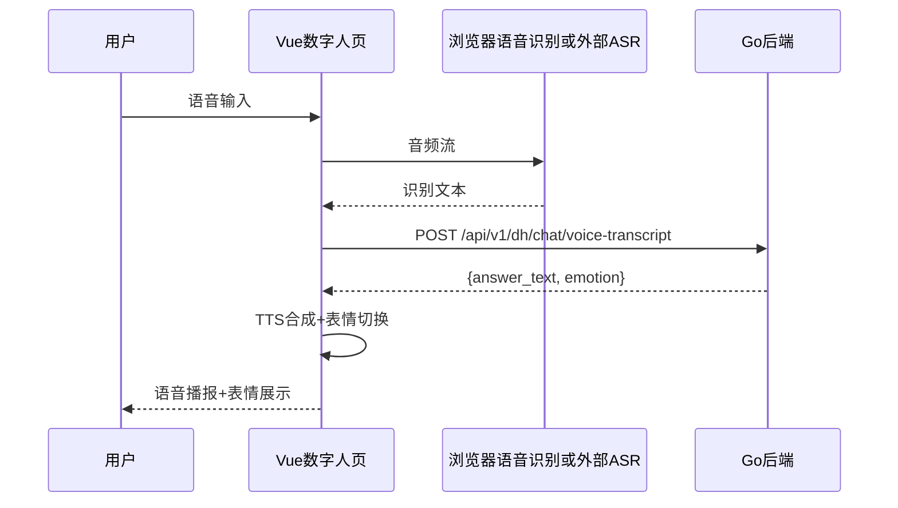

# 数字人集成文档

## 1. 概述

本文档描述当前 Web/Vue 数字人导览页与 Go 后端、Open-LLM-VTuber 的集成方式。项目主入口是 Go 服务托管的 Vue 页面 `/digital-human#/digital-human`，Open-LLM-VTuber 作为外部语音、Live2D 和口型驱动服务，通过 Go 的 `/vtuber-ws/*` 代理接入。

## 2. 架构设计

### 2.1 整体架构



### 2.2 模块职责

| 模块 | 职责 | 技术栈 |
|------|------|--------|
| Vue 数字人页 | Live2D 展示、文本输入转发、语音播放、打断、会话历史和游客形象切换 | Vue 3 / PixiJS / Live2D |
| Go 后端 | Cookie 鉴权、业务逻辑、RAG 问答、路线推荐、会话消息保存和 WebSocket 代理 | Go/Gin |
| Open-LLM-VTuber | 外部数字人语音和 Live2D 协议服务，默认监听 `127.0.0.1:12393` | Python |
| TTS | Open-LLM-VTuber 负责主数字人语音；Go 后端流式 TTS 和浏览器朗读仅作兜底 | Open-LLM-VTuber / Edge TTS |

## 3. API 接口规范

### 3.1 会话管理

#### POST /api/v1/dh/session/create

创建数字人会话。该接口需要登录后的 `auth_token` Cookie，并且 POST 请求需要 `csrf_token` Cookie 对应的 `X-CSRF-Token` 请求头。浏览器端由 Vue API 客户端自动携带。

**请求体：**
```json
{
  "user_id": "string (可选)",
  "scene": "string (可选，如: lingshan)",
  "location": "string (可选)",
  "preferences": ["string"]
}
```

**响应体：**
```json
{
  "session_id": "string",
  "expires_at": "string (RFC3339格式)"
}
```

### 3.2 文本聊天

#### POST /api/v1/dh/chat/text

处理文本输入，返回回答和情感状态。该接口需要登录后的 `auth_token` Cookie 与 `X-CSRF-Token` 请求头。

**请求体：**
```json
{
  "session_id": "string",
  "user_id": "string (可选)",
  "input_text": "string",
  "scene": "string (可选)",
  "location": "string (可选)",
  "preferences": ["string"]
}
```

**响应体：**
```json
{
  "answer_text": "string",
  "emotion": "neutral|warm|happy|calm|alert|apology",
  "route_payload": {
    "route_id": "string",
    "stops": ["string"]
  },
  "trace_id": "string"
}
```

### 3.3 语音识别聊天

#### POST /api/v1/dh/chat/voice-transcript

处理语音识别结果，返回回答和情感状态。该接口接收前端或外部语音服务给出的转写文本，本项目当前不在 Go 后端内置 ASR。该接口需要登录后的 `auth_token` Cookie 与 `X-CSRF-Token` 请求头。

**请求体：**
```json
{
  "session_id": "string",
  "user_id": "string (可选)",
  "transcript": "string",
  "scene": "string (可选)",
  "location": "string (可选)",
  "confidence": 0.95
}
```

**响应体：**
```json
{
  "answer_text": "string",
  "emotion": "neutral|warm|happy|calm|alert|apology",
  "route_payload": {...},
  "trace_id": "string"
}
```

### 3.4 反馈上报

#### POST /api/v1/dh/feedback

上报会话反馈数据。该接口需要登录后的 `auth_token` Cookie 与 `X-CSRF-Token` 请求头。

**请求体：**
```json
{
  "session_id": "string",
  "trace_id": "string",
  "question_type": "string (可选)",
  "response_time_ms": 1234,
  "rating": 5,
  "comment": "string (可选)"
}
```

### 3.5 健康检查

#### GET /api/v1/dh/health

检查数字人服务状态。

**响应体：**
```json
{
  "status": "healthy",
  "rag_service": "available",
  "route_service": "available",
  "timestamp": "string"
}
```

## 4. 情感映射规则

| Emotion | 含义 | Live2D表情 |
|---------|------|-----------|
| neutral | 默认中性 | default |
| warm | 温暖友好 | smile_soft |
| happy | 开心 | smile_big |
| calm | 平静 | calm |
| alert | 严肃提醒 | serious |
| apology | 抱歉 | sorry |

### 4.1 情感检测逻辑

后端根据回答内容自动检测情感：

- **apology**: 包含"抱歉"、"对不起"、"无法"
- **warm**: 包含"欢迎"、"您好"、"很高兴"
- **happy**: 包含"推荐"、"建议"、"最佳"
- **alert**: 包含"注意"、"提醒"、"警告"
- **neutral**: 默认

## 5. 数据流

### 5.1 文本交互流程



### 5.2 语音交互流程



## 6. 配置说明

当前仓库没有 `configs/digital_human.yaml`。数字人相关配置分散在以下位置：

- Go 后端配置：`configs/config.example.yaml` 与 `SCENIC_GUIDE_*` 环境变量。
- 景区与数字人角色配置：`configs/scenic_profiles/*.yaml`。
- 管理端默认数字人和游客是否允许切换：`/api/v1/admin/digital-human/config`。
- 游客可选 Live2D 形象：`/api/v1/digital-human/avatar-options`。当前仅开放 Live2D 官方 `mao_pro` 临时示例模型；Shizuku 因许可要求不得改名或改变设定，已停止作为灵山角色提供。
- Open-LLM-VTuber WebSocket 代理：Vue 端连接同源 `/vtuber-ws/client-ws`，Go 后端转发到 `127.0.0.1:12393`。

## 7. 错误处理

| 错误场景 | HTTP状态码 | 处理策略 |
|---------|-----------|----------|
| 参数错误 | 400 | 返回错误描述 |
| 会话不存在 | 404 | 创建新会话 |
| 服务超时 | 504 | 降级到本地回答 |
| RAG不可用 | 503 | 返回预设回答 |

## 8. 安全考虑

1. **会话隔离**: 每个会话独立，数据不交叉
2. **输入过滤**: 对用户输入进行内容安全检查
3. **限流控制**: 每分钟最多60次请求
4. **超时保护**: API调用设置超时时间
