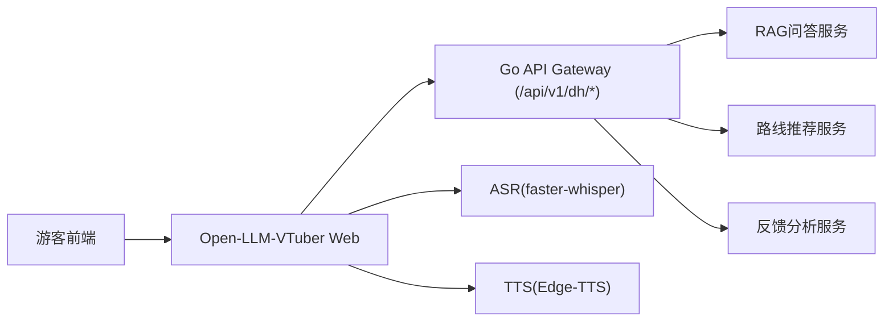
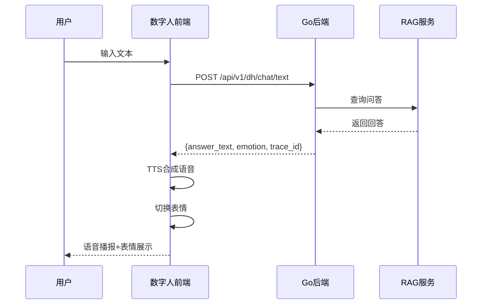
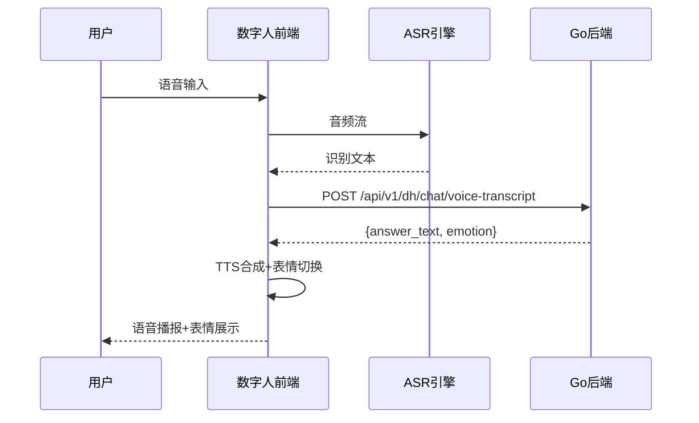

# 数字人集成文档

## 1. 概述

本文档描述了数字人导游系统与 Go 后端的集成方案。系统采用模块化设计，支持语音/文本交互、情感表达和口型同步。

## 2. 架构设计

### 2.1 整体架构



### 2.2 模块职责

| 模块 | 职责 | 技术栈 |
|------|------|--------|
| Open-LLM-VTuber | 数字人渲染、表情控制、口型同步 | Python/React |
| Go 后端 | 业务逻辑、RAG问答、路线推荐 | Go/Gin |
| ASR | 语音转文字 | faster-whisper/FunASR |
| TTS | 文字转语音 | Edge-TTS/MeloTTS |

## 3. API 接口规范

### 3.1 会话管理

#### POST /api/v1/dh/session/create

创建数字人会话。

**请求体：**
```json
{
  "user_id": "string (可选)",
  "scene": "string (可选，如: lingshan)",
  "location": "string (可选)",
  "preferences": ["string"]
}
```

**响应体：**
```json
{
  "session_id": "string",
  "expires_at": "string (RFC3339格式)"
}
```

### 3.2 文本聊天

#### POST /api/v1/dh/chat/text

处理文本输入，返回回答和情感状态。

**请求体：**
```json
{
  "session_id": "string",
  "user_id": "string (可选)",
  "input_text": "string",
  "scene": "string (可选)",
  "location": "string (可选)",
  "preferences": ["string"]
}
```

**响应体：**
```json
{
  "answer_text": "string",
  "emotion": "neutral|warm|happy|calm|alert|apology",
  "route_payload": {
    "route_id": "string",
    "stops": ["string"]
  },
  "trace_id": "string"
}
```

### 3.3 语音识别聊天

#### POST /api/v1/dh/chat/voice-transcript

处理语音识别结果，返回回答和情感状态。

**请求体：**
```json
{
  "session_id": "string",
  "user_id": "string (可选)",
  "transcript": "string",
  "scene": "string (可选)",
  "location": "string (可选)",
  "confidence": 0.95
}
```

**响应体：**
```json
{
  "answer_text": "string",
  "emotion": "neutral|warm|happy|calm|alert|apology",
  "route_payload": {...},
  "trace_id": "string"
}
```

### 3.4 反馈上报

#### POST /api/v1/dh/feedback

上报会话反馈数据。

**请求体：**
```json
{
  "session_id": "string",
  "trace_id": "string",
  "question_type": "string (可选)",
  "response_time_ms": 1234,
  "rating": 5,
  "comment": "string (可选)"
}
```

### 3.5 健康检查

#### GET /api/v1/dh/health

检查数字人服务状态。

**响应体：**
```json
{
  "status": "healthy",
  "rag_service": "available",
  "route_service": "available",
  "timestamp": "string"
}
```

## 4. 情感映射规则

| Emotion | 含义 | Live2D表情 |
|---------|------|-----------|
| neutral | 默认中性 | default |
| warm | 温暖友好 | smile_soft |
| happy | 开心 | smile_big |
| calm | 平静 | calm |
| alert | 严肃提醒 | serious |
| apology | 抱歉 | sorry |

### 4.1 情感检测逻辑

后端根据回答内容自动检测情感：

- **apology**: 包含"抱歉"、"对不起"、"无法"
- **warm**: 包含"欢迎"、"您好"、"很高兴"
- **happy**: 包含"推荐"、"建议"、"最佳"
- **alert**: 包含"注意"、"提醒"、"警告"
- **neutral**: 默认

## 5. 数据流

### 5.1 文本交互流程



### 5.2 语音交互流程



## 6. 配置说明

配置文件路径：`configs/digital_human.yaml`

```yaml
digital_human:
  provider: open_llm_vtuber
  go_backend:
    base_url: "http://127.0.0.1:8080"
    session_api: "/api/v1/dh/session/create"
    text_api: "/api/v1/dh/chat/text"
    voice_api: "/api/v1/dh/chat/voice-transcript"
    feedback_api: "/api/v1/dh/feedback"
```

## 7. 错误处理

| 错误场景 | HTTP状态码 | 处理策略 |
|---------|-----------|----------|
| 参数错误 | 400 | 返回错误描述 |
| 会话不存在 | 404 | 创建新会话 |
| 服务超时 | 504 | 降级到本地回答 |
| RAG不可用 | 503 | 返回预设回答 |

## 8. 安全考虑

1. **会话隔离**: 每个会话独立，数据不交叉
2. **输入过滤**: 对用户输入进行内容安全检查
3. **限流控制**: 每分钟最多60次请求
4. **超时保护**: API调用设置超时时间