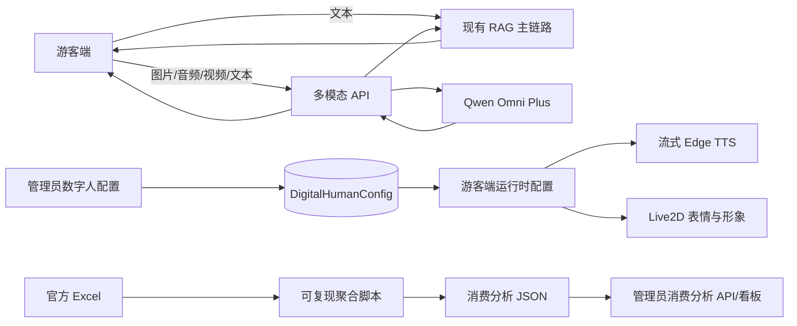

# P0：Qwen Omni 混合接入、数字人运行时配置与消费分析设计

## 1. 背景与目标

当前系统已经具备景区知识库、RAG 问答、管理员数字人配置、Live2D 游客端和流式 Edge TTS，但存在四个断点：

1. 多模态输入尚未形成独立、可回退的调用链；
2. 数字人后台保存的音色、语速、音量、默认情绪和形象没有全部作用到游客端运行时；
3. `scripts/e2e_eval.js` 使用“命中任一关键词即通过”，且延迟固定为 0，不能代表最终生成回答准确率；
4. 公开资料包中的 Excel 消费行为数据尚未进入系统分析链路。

本方案按方案 A 实施：保留现有 RAG 作为普通事实问答主链路，增加 Qwen Omni 多模态旁路，并以可配置、可观测、可回滚为约束完成数字人、评测和消费分析闭环。

## 2. 方案选择

### 2.1 主模型

采用阿里云百炼可购买、可通过 OpenAI 兼容接口调用的 `qwen3.5-omni-plus`。它用于文本、图片、音频、视频组合输入；文本/语音输出能力按当前业务需要先接入文本输出，语音输出仍沿用现有 TTS 链路，以减少对 Live2D 和浏览器播放的改动。

实时语音场景保留后续切换到 `qwen3.5-omni-plus-realtime` 的扩展位，但本期不把实时模型作为硬依赖。

官方资料：

- [阿里云百炼模型列表](https://help.aliyun.com/zh/model-studio/models)
- [Qwen Omni 使用说明](https://help.aliyun.com/zh/model-studio/qwen-omni)
- [阿里云百炼模型计费](https://help.aliyun.com/zh/model-studio/model-pricing)

### 2.2 备选方案

- 火山方舟 Seed：适合后续比较视频理解和实时能力，但供应商接口、计费和当前系统 OpenAI 兼容层需要另行适配。
- 智谱 GLM-4.6V：适合视觉问答备选，但本期不同时维护第二套生产链路。

选择 Qwen 的原因是：国内可直接购买、官方资料完整、接口与现有 OpenAI 兼容调用方式接近，并且能覆盖本项目需要的图文音视频输入。

## 3. 总体架构与数据流



边界规则：

- 普通文本景区事实问答不强制经过多模态模型，继续走现有 RAG，保证无外部模型时后台和基础问答可用；
- 带媒体的请求才进入 Qwen Omni；如果多模态服务不可用，返回明确的降级结果，不伪造媒体理解结论；
- 不修改 `Open-LLM-VTuber` 核心代码，数字人服务继续通过现有 WebSocket/代理能力联调；
- API Key 只从环境变量读取，不进入数据库、前端响应、日志或 CHANGELOG。

## 4. 多模态 API 与配置契约

### 4.1 服务端配置

在后端配置中增加以下环境变量，默认关闭多模态旁路：

```text
MULTIMODAL_ENABLED=false
MULTIMODAL_PROVIDER=qwen
MULTIMODAL_MODEL=qwen3.5-omni-plus
MULTIMODAL_BASE_URL=https://dashscope.aliyuncs.com/compatible-mode/v1
MULTIMODAL_API_KEY=<environment-only>
MULTIMODAL_TIMEOUT_SECONDS=60
```

配置校验要求：启用时必须同时存在 provider、model、base URL 和 API Key；启动时不打印 API Key，只打印 provider、model 和是否启用。

### 4.2 请求与响应

新增 `POST /api/v1/ai/multimodal/chat`，沿用现有会话、CSRF、限流和统一 JSON 响应结构。请求使用 `multipart/form-data`：

- `message`：可选文本，最大 4,000 个 Unicode 字符；没有文本时必须至少上传一个媒体文件；
- `image`：可选，单文件，允许 `image/jpeg`、`image/png`、`image/webp`，最大 10 MB；
- `audio`：可选，单文件，允许 `audio/wav`、`audio/mpeg`、`audio/ogg`、`audio/webm`，最大 20 MB、最长 120 秒；
- `video`：可选，单文件，允许 `video/mp4`、`video/webm`，最大 50 MB、最长 60 秒；
- 同一请求至少有文本或一个媒体，媒体总数不超过 3 个。

响应 `data` 至少包含：

```json
{
  "response": "...",
  "sources": [],
  "model": "qwen3.5-omni-plus",
  "modality": "text_image",
  "trace_id": "...",
  "degraded": false
}
```

保持 `/api/v1/ai/chat` 的响应和行为兼容，不把多模态模型替换成默认文本模型。

### 4.3 安全限制

- 只接受白名单 MIME 类型，并同时检查文件头，不信任客户端扩展名；
- 先落到临时目录，完成大小/类型/时长校验后再发送，失败时清理临时文件；
- 不接受任意远程 URL，避免 SSRF；本期不提供 URL 媒体输入；
- 日志只记录 trace ID、媒体类型、大小、耗时和错误分类，不记录 base64、原始媒体或 API Key；
- 请求超时、上游 4xx/5xx 和响应解析失败统一降级为可识别错误，不能把错误文本伪装成模型答案；
- 多模态服务使用独立超时和限流，不能阻塞普通 RAG 资源。

## 5. 数字人配置打通

### 5.1 现有配置保持兼容

保留现有管理员接口：

- `GET /api/v1/admin/digital-human/config`
- `PUT /api/v1/admin/digital-human/config`

继续使用现有字段 `voice_type`、`voice_tone`、`speed`、`volume`、`default_emotion`、`emotion_level`、`default_avatar_id` 和 `allow_avatar_switch`。新增安全的实际运行时字段：

- `voice_id`：Edge TTS 实际 voice ID，默认 `female_xiaoxiao`；
- `tts_rate`：可选显式速率字符串；未填写时由 `speed` 计算；
- `runtime_version`：配置更新时间版本，用于游客端缓存失效。

API 返回不包含任何服务端密钥。旧数据库记录缺少新字段时使用默认值，自动迁移保持可读。

### 5.2 游客端运行时链路

新增仅返回安全字段的游客端运行时配置接口：`GET /api/v1/digital-human/runtime-config`：

```json
{
  "voice_id": "female_xiaoxiao",
  "tts_rate": "-20%",
  "volume": 80,
  "default_emotion": "joy",
  "emotion_level": 3,
  "default_avatar_id": "mao_pro",
  "allow_avatar_switch": true,
  "runtime_version": "..."
}
```

游客端加载该配置后：

- TTS 请求使用 `voice_id` 和 `tts_rate`，移除 `DigitalHumanView.vue` 中固定的 `female_xiaoxiao`；
- `speed` 映射为速率时限制在 0.5～2.0，换算为 Edge TTS 的百分比格式；
- 音量统一映射为 0～1，交给 `AudioPlaybackController`，不把音量误当作 TTS voice 参数；
- 默认情绪和强度用于初始表情及无明确情绪标签时的兜底；模型或后端生成的明确情绪优先；
- 默认 Live2D 形象继续经过现有头像白名单校验；禁止通过配置注入任意文件路径或 WebSocket 配置文件。

管理端保存成功后，游客端下一次加载通过 `runtime_version` 获取新配置；当前会话不中断，正在播放的音频不强制重播。

## 6. 最终回答准确率评测

### 6.1 评测口径

将 `scripts/e2e_eval.js` 从“关键词 OR 命中”改为显式断言：

- `required_keywords`：全部命中；
- `keyword_groups`：每组至少命中一个，用于同义表达；
- `forbidden_keywords`：命中任意一个即失败；
- `min_answer_chars`：防止只返回关键词；
- `expected_answer_type`：事实、列表、路线、拒答等类型，用于报告分类。

旧的 `expected_keywords` 数据兼容迁移为一个必须全部命中的 `required_keywords`，不再按 OR 解释。评测只把规则断言作为硬指标，不用另一个大模型给自己打分。

### 6.2 真实指标

每条请求使用单调时钟记录从请求发送到完整响应结束的 `latency_ms`，记录 HTTP 状态、超时、解析错误、答案长度、命中/缺失/禁用词和回答预览。报告增加：

- 总体准确率、失败率、超时率；
- 按 `expected_answer_type` 和 `category` 分组的准确率；
- 延迟 P50、P95、最大值；
- 失败用例列表及可复现请求信息（不含敏感数据）。

输出到 `docs/eval-results/` 的带时间戳 JSON，同时保留一份最新摘要供后台读取。测试退出码在存在失败或超时时返回非零，便于 CI 和答辩材料使用。

## 7. 语音端到端延迟测试

新增独立脚本，不把“文本 RAG 延迟”冒充“语音端到端延迟”。测试分两种模式：

### 7.1 可重复的模拟链路

输入固定转写文本，调用现有 `/api/v1/dh/chat/voice-transcript`，再调用流式 TTS，记录：

1. `transcript_to_request_ms`：发送转写文本到收到回答；
2. `tts_first_byte_ms`：发起 TTS 到收到第一个音频字节；
3. `tts_complete_ms`：发起 TTS 到完整音频结束；
4. `voice_pipeline_total_ms`：从开始请求到完整音频结束。

每轮记录 trace ID、文本长度、音频字节数、HTTP 状态、错误分类，汇总 P50/P95/最大值。默认使用 10 条固定问题、3 次预热、20 次正式采样，间隔可配置。

### 7.2 真实麦克风链路

真实 ASR、Open-LLM-VTuber WebSocket 和设备播放延迟属于外部依赖，不在无服务环境下伪造结果。脚本提供可选的设备/服务参数；未启动外部服务时明确输出 `skipped_external_dependency`，仍可完成模拟链路测试。

## 8. 官方资料包消费行为分析

### 8.1 数据来源与可复现性

来源文件：

`D:\go web 01\示范景区公开资料包\景点景区旅游数据行为分析数据.xlsx`

原始 Excel 不复制到运行时数据库。新增可复现聚合命令/脚本，接收输入文件和输出路径，记录文件 SHA256、行数、字段版本、生成时间和筛选条件，生成小型 JSON 聚合结果，供后端读取。当前资料包已确认约 140,447 条行为记录、50,000 名游客、152 个景区/景点，覆盖 2025 年。

### 8.2 聚合指标

生成以下统计，金额统一保留 2 位小数，均值同时返回样本数：

- 总消费、人均总消费、消费中位数；
- 门票、餐饮、购物、交通、娱乐的金额与占比；
- 月度总消费、人均消费和样本数；
- 年龄段消费能力；
- 满意度与总消费的分组关系；
- 名称或内容包含“灵山”的专项子集；
- 同行人数、停留时长与消费的关系；
- 基于统计结果生成的运营建议，明确标注为分析建议而非事实。

空数据、缺失金额、非法负数和无法解析的满意度不参与对应指标，并在结果中返回清洗计数。灵山专项分析不改变全量统计分母。

### 8.3 后端接口

新增管理员接口：

- `GET /api/v1/admin/dashboard/consumption-analysis?scope=all|lingshan&period=2025`

接口只读取生成后的聚合 JSON，不在请求期间解析 Excel；返回 `source_metadata`、`summary`、`category_breakdown`、`monthly_trend`、`segments`、`recommendations` 和 `data_quality`。未生成分析文件时返回明确的“暂无消费分析数据”，不返回虚构图表数据。

## 9. 测试、验收与回滚

### 9.1 测试

- Go：配置校验、多模态请求边界、上游错误降级、数字人配置迁移与运行时字段映射、消费聚合读取和空数据行为；
- 前端：TTS 实际 voice/rate/volume、默认情绪、头像切换和配置加载失败时的兼容行为；
- 脚本：准确率断言、延迟百分位、超时非零退出码、语音首字节/完整音频计时、Excel 聚合固定样本；
- 集成：启用和关闭 `MULTIMODAL_ENABLED` 各运行一次；外部 Qwen、真实 TTS/ASR 未启动时只验证降级和模拟路径。

### 9.2 回滚

- `MULTIMODAL_ENABLED=false` 可立即回到纯 RAG；
- 新字段有默认值，旧数字人配置仍可读取；
- 消费分析接口只依赖独立生成文件，删除或替换该文件不影响问答主链路；
- 评测脚本和报告格式变更不修改知识库原始语料；
- 发布前不覆盖用户已有工作区改动，不提交 API Key、原始 Excel、模型缓存和音频缓存。

## 10. 本期不做

- 不把 Qwen Omni 替换为所有普通文本问答的默认模型；
- 不修改 `Open-LLM-VTuber` 核心协议和服务实现；
- 不把原始 Excel 直接导入生产数据库；
- 不实现基于大模型裁判的自动主观评分；
- 不在本期同时接入多个供应商的生产模型。

## 11. 验收标准

1. 无多模态 API Key 时，普通 RAG、后台和数字人文本链路保持可用；有媒体请求得到明确降级或成功响应；
2. 管理员配置的音色、语速、音量、情绪和默认形象能够在游客端运行时被观察到并影响实际请求；
3. 最终回答评测不再使用 OR 通过，报告包含真实延迟、P50/P95、失败和超时；
4. 语音基准报告同时提供回答耗时、首字节耗时、完整音频耗时，并区分模拟链路和外部链路；
5. 资料包 Excel 能生成可复现的消费分析结果，管理员接口能展示全量与灵山专项统计，缺失数据不被伪造。
